# Architecture — services, resources, sequences

Planning diagrams for the in-house engine. No containers are running yet; this is the target Compose topology. Contract: [MarketPlaceEngine.MD](./MarketPlaceEngine.MD). Plan: [PLAN.md](./PLAN.md). Stories: [USER_STORIES.md](./USER_STORIES.md).

Rendered diagrams (Mermaid sources live next to each PNG under [`architecture/`](./architecture/)):

| Image | View |
| --- | --- |
| [arch_01_services.png](./architecture/arch_01_services.png) | Deployables, stores, secrets, externals |
| [arch_08_data_model.png](./architecture/arch_08_data_model.png) | Postgres resources (ER) |
| [arch_09_redis_resources.png](./architecture/arch_09_redis_resources.png) | Redis keys, locks, streams |
| [arch_10_sale_status.png](./architecture/arch_10_sale_status.png) | Canonical `SaleStatus` state machine |
| [arch_05_seq_login.png](./architecture/arch_05_seq_login.png) | Login (US-01) |
| [arch_04_seq_create_vendor.png](./architecture/arch_04_seq_create_vendor.png) | Admin creates vendor on existing company (US-10) |
| [arch_02_seq_webhook_sale.png](./architecture/arch_02_seq_webhook_sale.png) | Webhook to canonical sale (US-04, US-05) |
| [arch_06_seq_nfe_ingest.png](./architecture/arch_06_seq_nfe_ingest.png) | Inbound NF-e to inventory |
| [arch_03_seq_nfe.png](./architecture/arch_03_seq_nfe.png) | Emit NF-e then label (US-06, US-07) |
| [arch_07_seq_publish.png](./architecture/arch_07_seq_publish.png) | Publish advertisement |

---

## 1. Services and resources

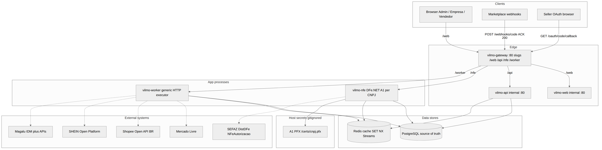

KISS: split only where failure domains differ. There is **no** container per marketplace.

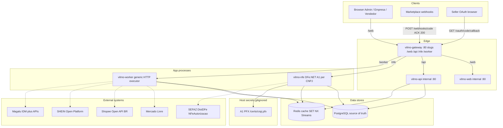

### Deployables

| Service | Host port | Internal | Responsibility | Must not |
| --- | --- | --- | --- | --- |
| `vilmo-gateway` | **80** (only public) | 80 | Nginx. Path slugs to HTTP services. | Publish 8080/8081/5432/6379 |
| `vilmo-web` | none | 80 | Metronic HTML at slug `/web` | Store marketplace secrets in the browser |
| `vilmo-api` | none | 80 | Auth, CRUD, OAuth, webhook **ACK only**. Slug `/api` | Call marketplace GET inside the webhook thread (ML 500 ms) |
| `vilmo-worker` | none | 80 | FetchOrder, publish, UploadInvoice, token refresh. Slug `/worker` | Own fiscal SOAP; listen on the host |
| `vilmo-nfe` | none | 80 | DistDFe ingest, `NFeAutorizacao`. Slug `/nfe` | Use another company's A1; listen on the host |
| `postgres` | none | 5432 | Companies, users, catalog, inventory, sales, bindings, certificates metadata | — |
| `redis` | none | 6379 | Idempotency, definition/config/vendor cache, Streams | Source of truth for money/stock |

Public slugs (see `deploy/docker-compose.yml`): `/web`, `/api`, `/nfe`, `/worker`. Marketplace callbacks stay at the root: `/webhooks/{code}`, `/oauth/{code}/callback` → `vilmo-api`. `/` redirects to `/web/`. Compose today uses HTTP echo stubs until the .NET images exist.

### Redis resources

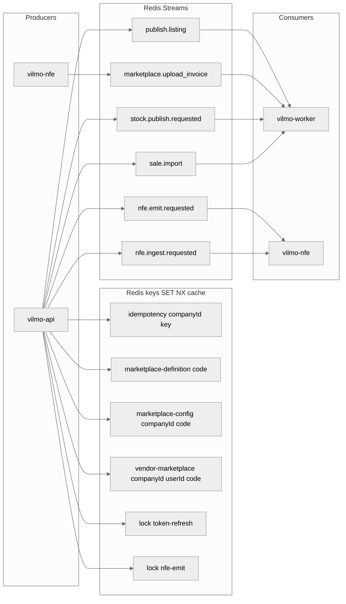

| Key / stream | Use |
| --- | --- |
| `idempotency:{companyId}:{key}` | HTTP lock 24h |
| `marketplace-definition:{code}` | Bindings cache |
| `marketplace-config:{companyId}:{code}` | Company app params |
| `vendor-marketplace:{companyId}:{userId}:{code}` | Vendor shop params |
| `lock:token-refresh:{companyId}:{userId}:{code}` | Refresh mutex |
| `lock:nfe-emit:{companyId}:{saleId}` | Emit mutex |
| Stream `sale.import` | Webhook → FetchOrder |
| Stream `nfe.ingest.requested` | Chave / XML ingest |
| Stream `nfe.emit.requested` | Outbound NF-e |
| Stream `stock.publish.requested` | Fan-out stock |
| Stream `marketplace.upload_invoice` | After authorized XML |

### Postgres (main tables)

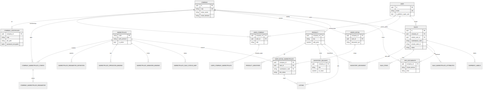

Identity: `company`, `user`, `user_company`, `company_certificate`, `users_detail`, `user_detail_marketplace`, `user_company_marketplace`.

Marketplace data: `marketplace`, `marketplace_parameter_definition`, `marketplace_operation_binding`, `marketplace_webhook_binding`, `company_marketplace_config`, `company_marketplace_parameter`, `marketplace_sale_field_definition`, `marketplace_sale_status_map`.

Catalog: `product`, `product_identifier`, `inventory_balance`, `inventory_movement`, `listing`.

Sales: `sales`, `sale_items`, `sale_marketplace_attributes`, `nfe_documents`, `shipment_labels`.

Every business unique index includes `company_id` (except catalog of `marketplace.code`).

### External systems

| System | Protocol | Used for |
| --- | --- | --- |
| Mercado Livre | OAuth2 + Bearer REST | Items, orders, shipments, NF-e XML, labels |
| Shopee BR | HMAC-SHA256 + shop token | Stock, orders, `upload_invoice_doc` |
| SHEIN | HMAC headers | Orders/stock when bindings exist |
| Magalu | OAuth ID Magalu | Portfolio, orders |
| SEFAZ | SOAP via DFe.NET | DistDFe + `NFeAutorizacao` |
| Printer | Browser PDF | 100×150 mm label (no IPP in v1) |

Generic executor loads **table rows** (cached in Redis). Adding Amazon = INSERT, not a new service.

---

## 2. Sequence — login (US-01)

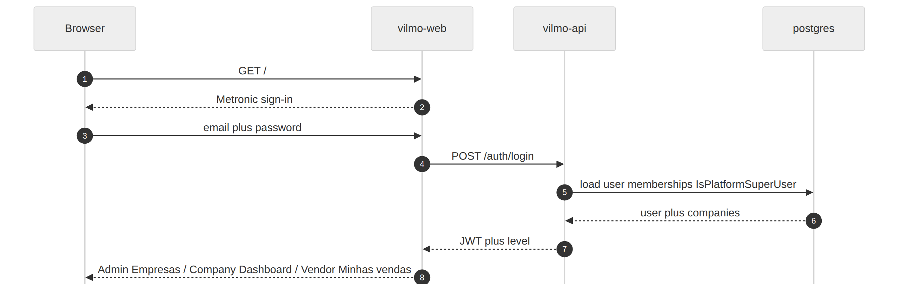

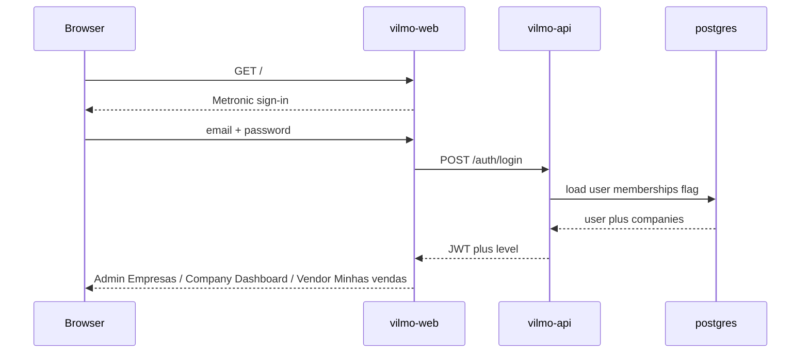

Later calls: `Authorization: Bearer` + `X-Company-Id` (admin picks a company; others only memberships).

---

## 3. Sequence — create vendor on an existing company (US-10)

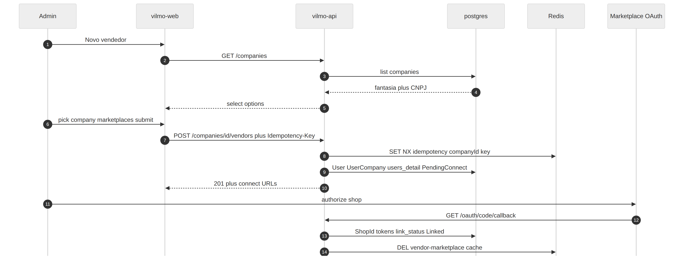

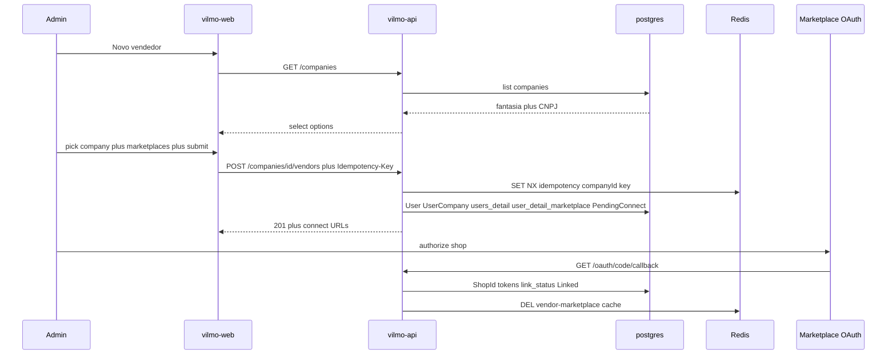

Company user: skip `GET /companies`; Empresa is read-only.

---

## 4. Sequence — webhook to canonical sale (US-04, US-05)

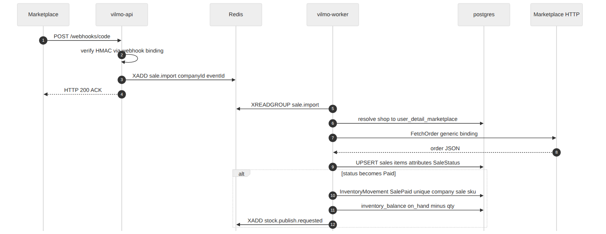

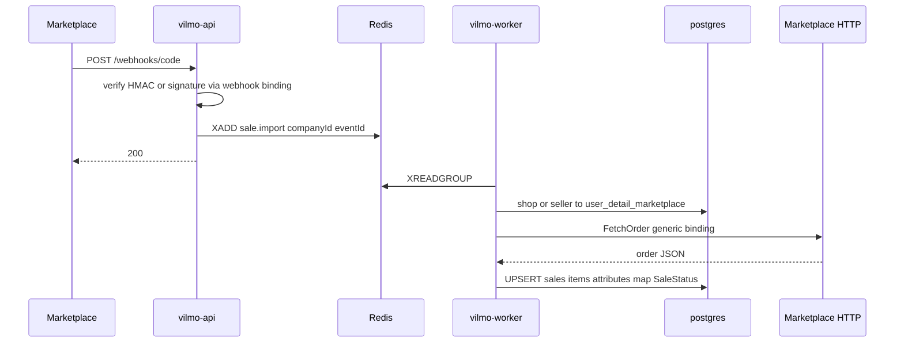

Unknown shop: ACK already sent; park event; never attach to a random vendor.

---

## 5. Sequence — emit NF-e then label (US-06, US-07)

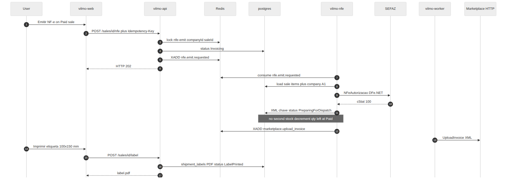

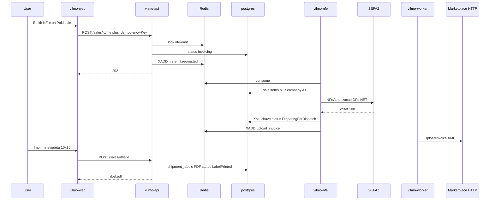

Reject: `InvoiceRejected`; emit button stays. Upload failure does not roll back the NF-e.

---

## 6. Sequence — inbound NF-e to inventory

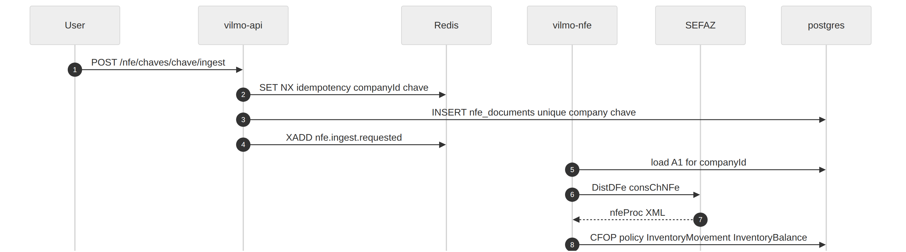

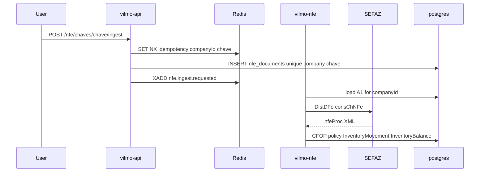

XML upload skips DistDFe when there is no A1.

---

## 7. Sequence — publish advertisement (default all linked shops)

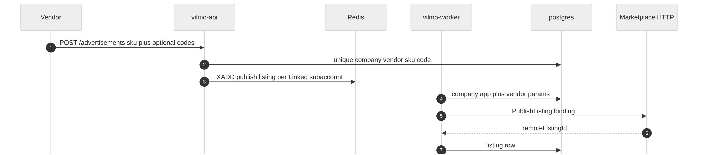

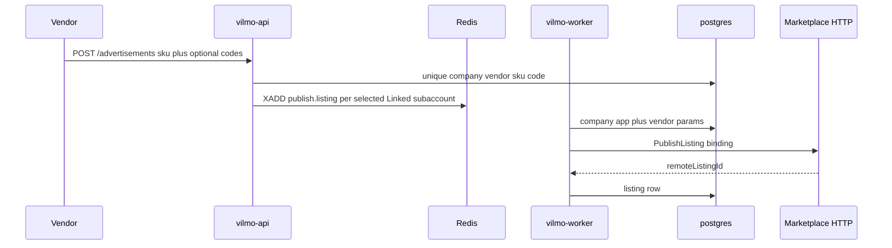

---

## 8. Request path (every mutating business call)

```
Browser
  -> vilmo-gateway :80  (/web /api /nfe /worker)
  -> vilmo-web or vilmo-api (Docker network only)
       JWT + X-Company-Id + Idempotency-Key
       Redis SET NX
       Postgres write
       Redis Stream
       202/200
  -> worker or nfe (async)
       generic executor or DFe.NET
       Postgres
```

Webhooks skip JWT and Idempotency-Key; they use marketplace event ids and resolve company + vendor from `user_detail_marketplace`.

---

## 9. Canonical sale status

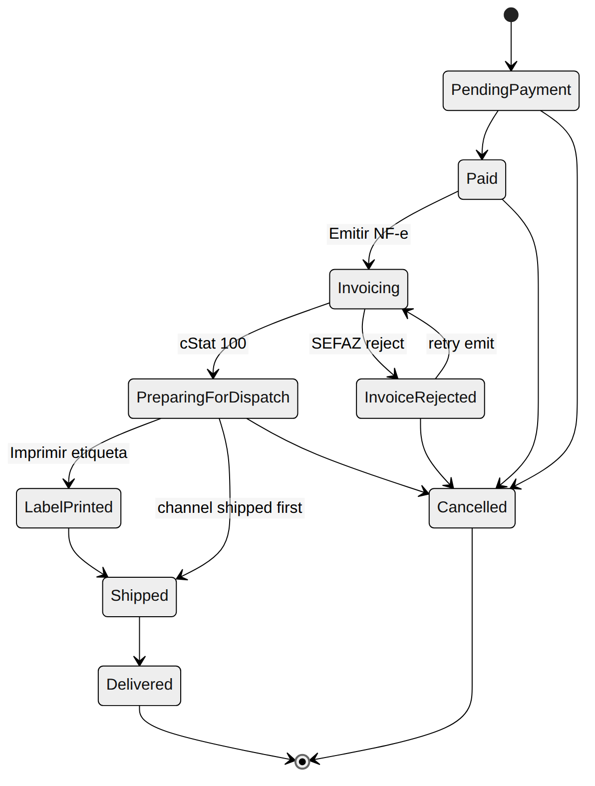

Marketplace “invoice pending / ready to ship” stays **Paid** until **our** NF-e is authorized (`cStat 100`), unless `invoiced_by_marketplace` is true. `InvoiceRejected` keeps **Emitir NF-e**. Upload of XML to the channel must not roll back an authorized NF-e.
