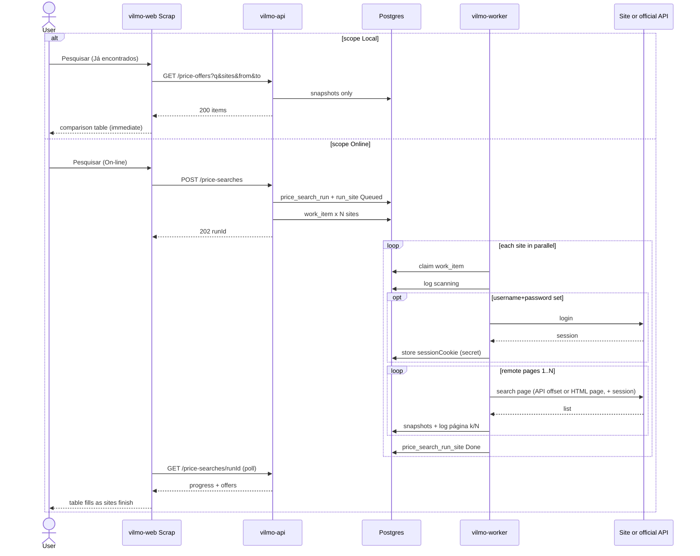

# Plan — Scrap / pesquisa de preços (no implementation)

This is the build plan only. **Do not implement** until a later task explicitly asks. No application code, Docker images, scrapers, or credentials are created in this revision.

Related: marketplace contract [MarketPlaceEngine.MD](./MarketPlaceEngine.MD), engine plan [PLAN.md](./PLAN.md), architecture [ARCHITECTURE.md](./ARCHITECTURE.md), stories [USER_STORIES.md](./USER_STORIES.md). UI: [UI.md](./UI.md).

Portuguese labels in the product. API codes in English.

---

## 1. Goal

Admin and Company users can:

1. Open a **Scrap** screen, type a search string (ex.: `carregador usb c`), and **select one or more sites**.
2. Choose **where** to search with a flag:
   - **On-line** — fetch live pages/APIs now (parallel workers), then **save** what was found.
   - **Já encontrados** — search **only** the table of offers already saved (no outbound HTTP). Instant.
3. On-line: each selected site is fetched **in parallel**. The screen shows per-site progress as results arrive — same pattern as NF-e ingest and Anúncios import logs.
4. Persist **every offer found** with **search datetime**, site, title, price, URL, seller, thumbnail, and raw snapshot.
5. Show a **comparison table** (types and prices across sites) and keep history so the same query can be compared over time.
6. Add / edit scrape sites in **Configurações** (URL template, parse recipe, **username / password** for site login, rate limits) **without a redeploy**.

This is **market research** (what the market is charging). It is **not** Anúncios import (seller’s own listings), not stock, and not POST `/items`.

---

## 2. Why helpers, not a scraper per site in the UI

The marketplace rule stays: **the browser never talks to Magalu/Shopee/ML HTML**. Core/UI enqueues; adapters run in `vilmo-worker`.

```text
Scrap UI (vilmo-web)
  → flag scope = Online | Local
  → Online: POST /price-searches  { query, siteCodes[], scope: "Online" }  → 202 { runId }
       poll GET /price-searches/{runId} + /price-search-logs
  → Local:  GET  /price-offers?q=&sites=&from=&to=   → 200 { items, counts }  (Postgres only)
  → unified OfferDTO
vilmo-api: ACK fast; **never** HTTP to the target sites (including Local)
vilmo-worker: one job per (runId, siteCode), in parallel
  → IPriceSearchAdapter.SearchAsync(ctx)
       Official API adapter  (preferred: ML, later Shopee/Magalu/SHEIN Open)
       HtmlRecipe helper     (CSS / JSON-LD driven by Configurações)
       Browser helper        (Playwright, last resort, isolated)
  → persist snapshots
```

**Helpers** are reusable building blocks. A new site is mostly a **row + recipe**, not a new C# project. A compiled adapter is only for sites that already have a stable official API or a login dance we cannot express as a recipe.

---

## 3. Official API first, HTML second, browser last

HTML scraping of storefront search pages is **fragile** (Cloudflare, JS render, layout changes) and often **against the site’s terms**. Prefer public/partner APIs the company already (or will) connect in Marketplaces.

| Site (v1 seed) | Example search URL (query = `carregador usb`) | Planned fetch mode |
| --- | --- | --- |
| Mercado Livre | `https://lista.mercadolivre.com.br/{slug}` | Prefer official `GET /sites/MLB/search?q=` (public search, no seller OAuth required). If that is blocked, worker logs in with Configurações **usuário/senha** and uses HtmlRecipe/Browser on the storefront. Do **not** depend on Marketplaces OAuth for Scrap. |
| Shopee | `https://shopee.com.br/search?keyword=` | Open Platform if app keys exist; otherwise storefront after **usuário/senha**. HTML is bot-protected — recipe or Browser. |
| Magazine Luiza | `https://www.magazineluiza.com.br/busca/` | Storefront / B2B after Configurações **usuário/senha**. Partner API only if separately configured. |
| SHEIN | `https://br.shein.com/pdsearch/{query}/` | Open Platform if configured; otherwise storefront after **usuário/senha**. JS-heavy. |
| Joom | `https://joom.pro/pt-br/search?q=` | HtmlRecipe; login with **usuário/senha** when the list is behind a wall. Browser if blocked. |
| Martins Atacado | `https://www.martinsatacado.com.br/busca/` | B2B: **usuário/senha** required before search. |

**Do not commit** any site email/password into the repo, env samples, or this document. Company staff enter them in Configurações (`username` + `password` with `is_secret`). Worker never echoes passwords in logs or snapshots.

Feature flag per company **and** per site: enable/disable without redeploy.

---

## 4. Screens

### 4.1 Menu

| Level | Menu |
| --- | --- |
| Admin, Company | **Scrap** (after Anúncios). Configurações gains **Sites de busca**. |
| Vendor | Hidden. Competitive prices are company data. |

Route: `#/scrap`. Config sites: `#/config` section or `#/config/scrap-sites`.

### 4.2 Scrap (run a search)

```
┌ Scrap ─────────────────────────────────────────────────────────┐
│ Busca  [ carregador usb c          ]                           │
│ Onde   (•) On-line — buscar agora nos sites e gravar           │
│        ( ) Já encontrados — só a tabela salva                  │
│ Sites  [x] Mercado Livre  [x] Shopee  [ ] Magalu               │
│        [x] SHEIN  [ ] Joom  [ ] Martins                        │
│ Páginas on-line: cada site usa o máx. de Configurações         │
│   (padrão 5; opcional: limitar esta busca a [ _ ] páginas)     │
│ [ Pesquisar ]                                                  │
│                                                                │
│ ── se On-line ──────────────────────────────────────────────── │
│ Mercado Livre  ████████░░  24 ofertas · 13:40:02               │
│ Shopee         ██████░░░░  consultando…                        │
│ SHEIN          ░░░░░░░░░░  na fila                             │
│                                                                │
│ Comparar  (tabela)     Histórico desta busca                   │
└────────────────────────────────────────────────────────────────┘
```

**Flag `scope` (UI copy: “Onde”)**

| Value | API | Worker | Writes snapshots | Progress bars |
| --- | --- | --- | --- | --- |
| `Online` | `POST /price-searches` → 202 | Yes, one job per site | Yes | Yes |
| `Local` | `GET /price-offers?...` → 200 | No | No | No — table fills immediately |

- Default: **Já encontrados** when opening Scrap (cheap, no rate limits). User switches to **On-line** when they want fresh prices.
- Site checkboxes apply to **both** modes (Local filters `site_code IN (...)`).
- Selecting a site that is disabled or missing recipe → checkbox disabled + hint (“Cadastre em Configurações”). On Local, a site with **no saved rows** is still selectable; the column shows “—”.
- **On-line Pesquisar** → `202` immediately; progress rows update as each site job finishes (poll 2s, same as import logs).
- Failed site (401, 403, timeout, robots deny, empty parse) → red bar + technical JSON; other sites keep running.
- **Já encontrados Pesquisar** → no queue. Empty result: “Nenhuma oferta salva para esta busca. Marque On-line para pesquisar nos sites.”
- Local extras (filters on the table, not a second search): date **de / até** (`observedAt`), **último preço por anúncio** (default on) vs **histórico**.
- On-line **Páginas**: each ticked site walks **its own** `maxPages` from Configurações (**default 5**). An optional per-run field may **lower** that for this search only; it cannot exceed the site’s configured `maxPages`. Progress can show `página 2/5`.

### 4.3 Comparison table

Rows = clustered offers for this `runId` (and optionally previous runs of the same query). Columns = sites.

| Produto (agrupado) | Mercado Livre | Shopee | Magalu | SHEIN | Joom | Martins |
| --- | --- | --- | --- | --- | --- | --- |
| Carregador USB-C 20W | R$ 29,90 Abrir ↗ | R$ 32,00 Abrir ↗ | — | R$ 27,50 Abrir ↗ | — | R$ 24,90 Abrir ↗ |
| … | | | | | | |

Each cell: **price** (clickable), optional seller, **open-in-new-window link**, observed-at.

**Order (Asc / Desc)** — clickable column headers, not a fixed sort.

| Column | Sorts by |
| --- | --- |
| Produto | Grouped title A–Z / Z–A |
| Preço (mín. entre sites) | Lowest (or highest) price among ticked sites in that row |
| Each site column | That site’s price (`—` last) |
| Atualizado | `observedAt` |

Default: **Preço mín. Asc** (cheapest first). One active column at a time; second click toggles Asc ↔ Desc. Arrow on the header (▲ / ▼).

- **Local:** `GET /price-offers?sort=…&dir=…&page=1&pageSize=50` (server-side).
- **On-line (current run):** same on `GET /price-searches/{runId}`.

**Pagination (two layers)**

1. **Live / remote (worker, On-line only)** — walk the marketplace search **pages** until `pages` requested, `maxPages` cap, empty page, or `paging.total` reached. Each page respects `delayMs`. Adapters **must** paginate; a single HTTP call is not enough.
   - Mercado Livre: `GET /sites/MLB/search?q=&offset=&limit=50` using `paging.total`.
   - Official JSON: `OfficialSearchHelper` loops offset/cursor from the recipe (`pageParam` / `offsetParam` / `cursorPath`).
   - HtmlRecipe: `{page}` in `searchUrlTemplate` or `nextPagePath` (CSS/rel=next). Stop on duplicate `remoteId`s or empty list.
   - Browser: same stop rules; no infinite scroll into thousands of SKUs in v1.
2. **Table (UI)** — the comparison grid is paged: **50 rows per page**, Página anterior / seguinte, “Mostrando 1–50 de 180”. Sort/filter resets to page 1. This applies to **both** On-line (after snapshots land) and Já encontrados.

v1 does **not** fetch the entire marketplace catalog. Live search is “up to N pages per site”, then the table pages through **what was saved**.

**Open in a new window:** every offer `url` / permalink is `<a href="…" target="_blank" rel="noopener noreferrer">`. Label: price text plus **Abrir**. Missing URL → price as plain text, no link. Do **not** embed the marketplace in an iframe.

Filters (unchanged): site, min/max BRL, only in-stock if the snapshot has it.

v1 clustering: normalize title (lowercase, strip accents, collapse whitespace) + optional EAN/GTIN when the page/API exposes it. v2: fuzzy / embedding — out of this plan.

### 4.4 Configurações — Sites de busca

Admin/Company only. One card per site (like Marketplaces da empresa).

```
┌ Sites de busca ────────────────────────────────────────────┐
│ Mercado Livre                          [x] ativo           │
│ Usuário  [                      ]                          │
│ Senha    [                      ]   (nunca exibida de novo)│
│ Máx. páginas  [ 5 ]                                        │
│ … receita / URL …                                          │
└────────────────────────────────────────────────────────────┘
```

Fields:

| Field | Purpose |
| --- | --- |
| `code` | Stable id: `MercadoLivre`, `Shopee`, `Magalu`, `Shein`, `Joom`, `MartinsAtacado` |
| `displayName` | Label on Scrap |
| `enabled` | Feature flag |
| `fetchMode` | `OfficialApi` \| `HtmlRecipe` \| `Browser` |
| `searchUrlTemplate` | e.g. `https://joom.pro/pt-br/search?q={query}` |
| `resultListPath` | CSS or JSON path for the list |
| `titlePath`, `pricePath`, `urlPath`, `imagePath`, `sellerPath`, `eanPath` | Recipe |
| `maxPages` | Hard cap on live pages **per site**. Seed **5**. Editable in Configurações. Worker uses `min(pagesRequested, maxPages)` for that site. |
| `delayMs` | Pause between remote pages (e.g. ≥ 1000 ms) |
| `pageParam` / `offsetParam` / `limitParam` | How the live URL encodes page 2+ (`offset`, `page`, `cursor`) |
| `pageSize` | Remote page size (e.g. ML 50) |
| `nextPagePath` | Optional CSS/JSON path to “next” when there is no page number |
| `respectRobots` | Default true |
| `username` | Site login (email / CPF / CNPJ as that site expects). Per company. Shown in the form. Empty = try unauthenticated search. |
| `password` | Site login password. `is_secret` via SecretProtector. **Write-only** in the UI: GET never returns it; PUT empty means “keep current”. |
| `loginUrl` | Optional login page if HtmlRecipe (e.g. Magalu / Martins). Empty = adapter default for that `code`. |
| `sessionCookie` | Worker-managed after a successful login. `is_secret`. Not edited by the user. |

**Adicionar site** creates a new `code` at runtime (same idea as `POST /marketplaces`). Worker uses `HtmlRecipe` unless `fetchMode` is OfficialApi and a compiled adapter exists for that code.

#### Login (worker only)

Username and password live on **each site card** in Configurações — not in Marketplaces OAuth, not in the browser, not in git.

```text
On-line job for site S:
  1. If username+password set:
       if sessionCookie missing/expired or last search got 401 / login HTML:
         POST/fill loginUrl (or adapter default)
         store sessionCookie (TTL)
       attach session to every search page
  2. Else: unauthenticated search (ML public API, public HTML).
  3. Login fails (bad password, captcha, 2FA): that site → Failed,
     “Revise usuário e senha em Configurações”. Other sites continue.
  4. Session dies mid-run: re-login **once**, then fail the site.
```

- Progress log may show `entrando…` then `página 2/5`. Never log the password; mask username (`a***@x.com`).
- 2FA / SMS / CAPTCHA: out of v1 — fail with that reason. Do not open an interactive challenge in vilmo-web.
- These fields **authenticate**; they do **not** replace `resultListPath` / `titlePath` / `pricePath`. After login the worker still needs a recipe or an official search JSON.

Seed `scrape_site_parameter` (editable later in Configurações). **Do not seed passwords.**

| site | key | value | is_secret |
|------|-----|-------|-----------|
| Mercado Livre | `maxPages` | `5` | false |
| Mercado Livre | `limit` | `50` | false |
| Mercado Livre | `username` | *(empty until company fills)* | false |
| Mercado Livre | `password` | *(empty until company fills)* | true |
| Shopee | `maxPages` | `5` | false |
| Shopee | `username` / `password` | empty | password true |
| Magalu | `maxPages` | `5` | false |
| Magalu | `username` / `password` | empty | password true |
| SHEIN | `maxPages` | `5` | false |
| SHEIN | `username` / `password` | empty | password true |
| Joom | `maxPages` | `5` | false |
| Joom | `username` / `password` | empty | password true |
| Martins | `maxPages` | `5` | false |
| Martins | `username` / `password` | empty | password true |

---

## 5. Domain

### 5.1 Unified DTO (internal)

```text
PriceOffer
  siteCode, remoteId, title, url
  price, currency          // BRL
  sellerName?, thumbnail?
  ean?, condition?, listingType?
  inStock?, shippingPrice?
  observedAt               // UTC from worker
  snapshotJson             // raw API/HTML extract, no secrets
```

UI and comparison tables only read this DTO. Adapters never leak into `vilmo-web`.

### 5.2 Persistence (Postgres)

| Table | Role |
| --- | --- |
| `scrape_site` | Catalog of sites (platform + per-company enable) |
| `scrape_site_parameter` | Recipe + secrets (`is_secret`) |
| `price_search_run` | `id`, `company_id`, `query`, `query_normalized`, `scope` (`Online` / `Local` — Local runs are optional audit rows, default **no insert**), `started_at`, `created_by` |
| `price_search_run_site` | `run_id`, `site_code`, `status` (Queued/Running/Done/Failed), `http_status`, `offer_count`, `error` |
| `price_offer_snapshot` | One row per offer observed: `run_id`, `site_code`, `remote_id`, fields above, unique `(run_id, site_code, remote_id)` |
| `price_search_log` | Progress steps (received, queued, scanning, parsed, done, failed) — same UX as `listing_import_log` |

History: each **On-line** run inserts new snapshots (append-only). Local never inserts. Comparing “today vs last week” is two On-line `run_id`s with the same `query_normalized`, or Local with `from`/`to` on `observed_at`.

**Local query (v1):** company-scoped `price_offer_snapshot` where:

- selected `site_code`s, and
- `query_normalized` of the run that created the row matches the typed query, **or** title/EAN `ILIKE` the query tokens.

Indexes: `(company_id, site_code, observed_at)`, `(company_id, query via run)`, GIN/trigram on `title` when we add `pg_trgm` (v1 can be `ILIKE` + limit 400).

Default cell for comparison: **latest** `observed_at` per `(site_code, remote_id)` so the table is not one row per scrape.

Do **not** write `InventoryBalance` or `Listing`. Local search does **not** read `product` / `advertisement` unless we later add an explicit “incluir meu catálogo” flag (out of v1).

### 5.3 Work

```text
WorkKinds.PriceSearch = "price.search.requested"
Payload: { runId, siteCode, query, pages, actorUserId }
```

API inserts **one work item per selected site**. Worker `DrainAsync` already takes 20 pending items — that is the fan-out. Optional later: Redis concurrency cap per site (`delayMs`, circuit breaker).

---

## 6. Adapter + helpers (worker)

```text
IPriceSearchAdapter
  string SiteCode { get; }
  Task<IReadOnlyList<PriceOffer>> SearchAsync(PriceSearchContext ctx, ct)

PriceSearchContext
  CompanyId, Query, SearchUrl, AccessToken?, Username?, Password?, Session?, Recipe, MaxPages, PagesRequested, Delay
```

| Helper (in-process, not a deployable) | Does |
| --- | --- |
| `SearchUrlBuilder` | `{query}` / `{slug}` encoding per site |
| `OfficialSearchHelper` | Bearer GET + **page/offset/cursor loop** until empty, total, or max pages |
| `HtmlRecipeParser` | AngleSharp (or similar) + recipe paths |
| `JsonLdProductParser` | `application/ld+json` Product/Offer |
| `PriceNormalizer` | `R$ 1.234,56` → `1234.56` BRL |
| `RobotsChecker` | Cache robots.txt; skip if disallowed |
| `RateLimiter` | Per siteCode, honor `delayMs` / 429 |
| `SiteLoginHelper` | Uses Configurações `username`/`password`/`loginUrl`; caches `sessionCookie`; one retry on 401 |
| `BrowserSearchHelper` | Playwright **only** if `fetchMode=Browser`; dedicated optional process later |

**Mercado Livre v1 adapter (reference implementation):** `GET https://api.mercadolibre.com/sites/MLB/search?q={query}&offset={n}&limit=50` **without** Marketplaces OAuth (public search). Loop while `offset + limit < paging.total` and page count ≤ `min(pagesRequested, maxPages)`. Map `results[].id, title, price, permalink, thumbnail, seller`. If public search is blocked (403) and `username`/`password` are set, fall back to storefront login + HtmlRecipe. Expired Marketplaces OAuth must **not** block Scrap.

Generic `HtmlRecipeAdapter` implements `IPriceSearchAdapter` for any `code` whose `fetchMode=HtmlRecipe`. Compiled adapters register by `SiteCode` and win over the generic one.

---

## 7. Sequence



HTTP handler: **no** outbound fetch. Idempotency-Key on POST (Online only). Dedupe snapshots by `(run_id, site_code, remote_id)`. Local GET is read-only and not idempotent.

---

## 8. API (sketch)

| Method | Path | Result |
| --- | --- | --- |
| `POST` | `/price-searches` | 202 `{ runId, query, sites[] }` body `{ query, siteCodes[], scope: "Online", pages? }`. `pages` clamped to each site’s `maxPages`. `scope: "Local"` on POST is **400** — use GET. |
| `GET` | `/price-offers` | 200 `{ items, counts, page, pageSize, total }` query `q`, `sites`, `from`, `to`, `latestOnly=true`, `sort`, `dir`, `page`, `pageSize`. Local table search. |
| `GET` | `/price-searches` | Previous **On-line** runs (datetime, query, offer counts) |
| `GET` | `/price-searches/{runId}` | Run + per-site status + offers (filter `site`, `sort`, `dir`, `page`, `pageSize`) |
| `GET` | `/price-search-logs?runId=` | Progress log (Online only) |
| `GET` | `/scrape-sites` | Enabled sites + recipe completeness + `username` + `passwordSet` (never the password) |
| `PUT` | `/scrape-sites/{code}` | Company enable + parameters including `username`, `password` (write-only), `maxPages` |
| `POST` | `/scrape-sites` | Admin: register a new `code` |

Company-scoped. Vendor → 404. Demo tokens must not hit real sites (same rule as ML import).

---

## 9. Legal, abuse, and ops

- Respect `robots.txt` when `fetchMode` is Html/Browser. Official APIs use their rate-limit headers / 429 backoff.
- Identify Vilmo with a contactable User-Agent on HTML mode.
- Cap `maxPages` (seed **5** per site, editable in Configurações) and `delayMs` (e.g. ≥ 1000 ms) in seed recipes.
- Circuit breaker per site: consecutive 403/429 → skip until cooldown.
- Store snapshots, not full HTML dumps of logged-in account pages, if we can extract the list JSON instead.
- Secrets only in `scrape_site_parameter` (`password`, `sessionCookie`). Rotate any password that was pasted into chat. GET `/scrape-sites` returns `passwordSet: true/false`, never the secret.

---

## 10. Phased delivery (when implementation is requested)

1. **Tables + Scrap UI shell + scope flag** — query, **On-line / Já encontrados**, site checkboxes, Local GET against empty table, Configurações list with seed rows including **`maxPages = 5`** and empty **usuário / senha** fields.
2. **Mercado Livre public search adapter** — On-line fills snapshots **without** Marketplaces OAuth; Local then finds the same query without calling ML again. Username/password unused unless public search is blocked.
3. **HtmlRecipe helper + SiteLoginHelper** — Joom / Martins (and Magalu) using Configurações usuário/senha before search.
4. **Shopee / Magalu / SHEIN** — Official APIs if app keys exist; otherwise HtmlRecipe after Configurações usuário/senha. Keep disabled with a hint if login+recipe both missing.
5. **Browser helper** — only if a flagged site cannot be read as API or static HTML.
6. **History compare** — Local `from`/`to`, or pick two On-line runs of the same query, diff prices.

Success for phase 2:

- On-line `carregador usb` + Mercado Livre → offers with price + permalink, `observedAt` set, stock **unchanged**.
- Já encontrados with the same string → same rows from Postgres, **zero** outbound ML HTTP.

---

## 11. Out of scope

- Changing `InventoryBalance` / sale price from scraped numbers (a later “sugerir preço” can read snapshots).
- Publishing or pausing ads from Scrap.
- Scraping from the user’s browser, browser extensions, or putting site passwords in frontend JS / git.
- Interactive 2FA / CAPTCHA in the Scrap UI.
- A new microservice per site.
- Fuzzy ML clustering, alerts, or scheduled recurring On-line searches (natural follow-ups after v1).
- Searching Vilmo `product` / `advertisement` in Local mode (ERP catalog is not “found on the web”).

---

## 12. Open decisions (resolve at implementation time)

- Exact CSS/JSON paths and `loginUrl` form fields for Joom, Martins, Magalu (capture one sample in a lab, not in git with PII). Username/password do not invent those paths.
- Whether Magalu/Shopee/SHEIN wait for Open API apps vs HtmlRecipe after login vs Browser.
- Whether `scrape_site` is platform-global (admin defines recipes) + company enablement (like `marketplace` + `company_marketplace_config`) — **recommended**, so recipes are not copied per tenant. **Credentials are always per company.**
- Local match: only snapshots from runs with the same `query_normalized`, vs full-text on all titles (broader, noisier).
- Local default date window (all time vs last 30 days).
- Session TTL and cookie vs bearer after login (site-specific; discover at implementation).

---

## 13. Status and gaps (plan only — nothing is built)

**How it is going:** architecture is decided and written. **No Scrap screen, APIs, tables, or adapters exist in the running app.** Configurações today is only A1 certificate. That empty first ship is **accepted**.

### Decided (in this plan)

- Dual search flag: **On-line** (workers + persist) vs **Já encontrados** (Postgres only). Empty Local until the first successful On-line run — **accepted**.
- Comparison table: **Asc/Desc** on title, min price, per-site price, `observedAt`. Default cheapest first.
- Offer permalinks open in a **new tab** (`target="_blank"` + `noopener`).
- Live search paginates remote APIs/HTML up to each site’s **`maxPages` (default 5 in Configurações)**; the comparison table pages saved rows (50). Table “página 2” does not fetch remote page 2 — accepted.
- **Per-site `username` + `password`** in Configurações for storefront/B2B login. Worker logs in, caches session, retries once if the session dies. Scrap does **not** wait on Marketplaces OAuth.
- Cross-site grouping stays **title normalize + optional EAN** in v1; fuzzy matching **later** — accepted.
- Unified `PriceOffer`, helpers, Configurações recipes, parallel site jobs.
- Official/public API before HTML; browser last.
- Vendor cannot see Scrap.
- Stock / ads are not written.

### Remaining gaps (still real)

| Gap | Why it still matters after usuário/senha |
| --- | --- |
| **Not implemented** | Plan file only. Accepted as “do later”; still the only reason Scrap does not exist in the app. |
| **Parse recipes still missing** | Login gets a *session*. The worker still needs `resultListPath` / `titlePath` / `pricePath` (or official JSON). Joom/Martins/Magalu CSS or JSON paths are unknown. Username/password does not fill those fields. |
| **Login form per site unknown** | `loginUrl`, field names, CSRF, cookie vs bearer — not captured. `SiteLoginHelper` cannot run until one lab login is recorded (no PII in git). |
| **2FA / CAPTCHA / Cloudflare** | If Magalu/Shopee/SHEIN/Joom show a challenge after password, v1 **fails that site**. No interactive 2FA in the UI. |
| **ML official API ≠ seller password** | Public `GET /sites/MLB/search` does not use the ML account password. Seller email/password is only for a storefront fallback. Anúncios OAuth stays a separate reconnect. |
| **Local relevance** | `ILIKE` will miss accents/typos and may return too much. No `pg_trgm` / FTS yet. |
| **ToS / robots / 403** | HTML mode may be blocked even after login; we have no lab samples of success vs block pages. |
| **Infinite-scroll HTML** | No `page=` / no `next` → stop after page 1 unless Browser (deferred). |
| **Remote page cap** | Live walk stops at each site’s `maxPages` (default **5**). Will not dump a full ML ranking. |
| **History UX** | Two-run diff is phase 6. |
| **Open product decisions** | Local match rule (`query_normalized` vs all titles); default date window; global recipes vs copy-per-tenant. |

### Gaps that are acceptable to defer

- Fuzzy / embedding match (explicitly later).
- Playwright browser helper (until a logged-in HTML site cannot be parsed).
- Scheduled On-line refresh, price alerts, “sugerir preço”.
- Include Vilmo catalog SKUs in the same table.
- Shopee / Magalu / SHEIN Open APIs if ML public search + one logged-in HtmlRecipe site ships first.

### What “done” is *not*

Live import of **your** ML ads (Anúncios) is a different feature and does not populate Scrap snapshots. A user who only imported ads still has an **empty** Já encontrados table until they run Scrap On-line. Expired Marketplaces OAuth does **not** block Scrap ML public search.
