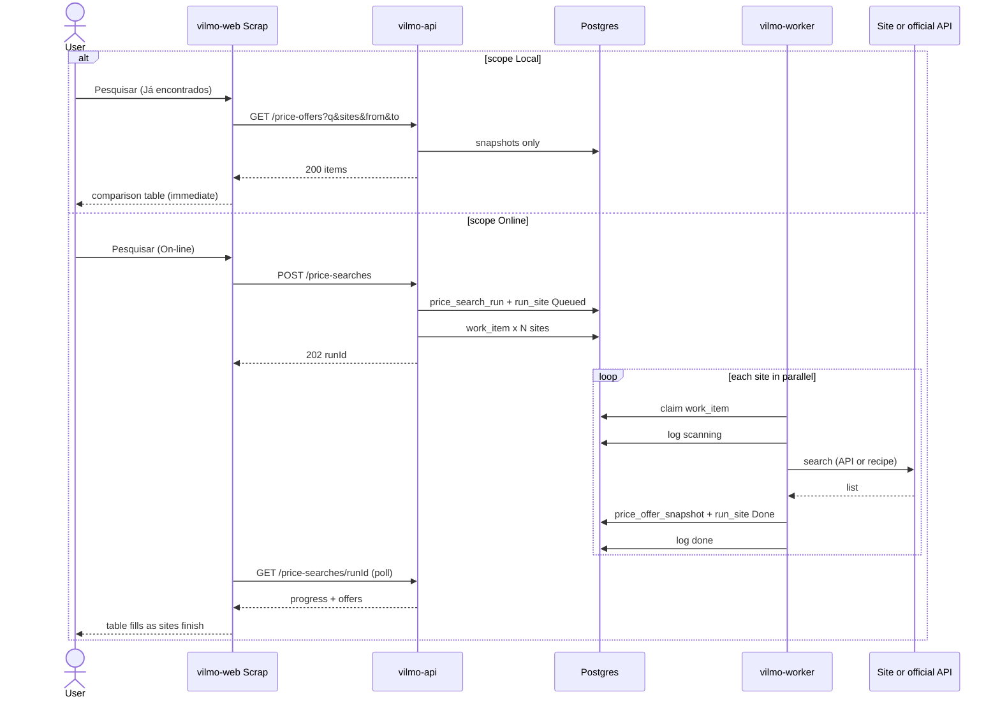

# Plan — Scrap / pesquisa de preços (no implementation)

This is the build plan only. **Do not implement** until a later task explicitly asks. No application code, Docker images, scrapers, or credentials are created in this revision.

Related: marketplace contract [MarketPlaceEngine.MD](./MarketPlaceEngine.MD), engine plan [PLAN.md](./PLAN.md), architecture [ARCHITECTURE.md](./ARCHITECTURE.md), stories [USER_STORIES.md](./USER_STORIES.md). UI: [UI.md](./UI.md).

Portuguese labels in the product. API codes in English.

---

## 1. Goal

Admin and Company users can:

1. Open a **Scrap** screen, type a search string (ex.: `carregador usb c`), and **select one or more sites**.
2. Choose **where** to search with a flag:
   - **On-line** — fetch live pages/APIs now (parallel workers), then **save** what was found.
   - **Já encontrados** — search **only** the table of offers already saved (no outbound HTTP). Instant.
3. On-line: each selected site is fetched **in parallel**. The screen shows per-site progress as results arrive — same pattern as NF-e ingest and Anúncios import logs.
4. Persist **every offer found** with **search datetime**, site, title, price, URL, seller, thumbnail, and raw snapshot.
5. Show a **comparison table** (types and prices across sites) and keep history so the same query can be compared over time.
6. Add / edit scrape sites in **Configurações** (URL template, parse recipe, secrets, rate limits) **without a redeploy**.

This is **market research** (what the market is charging). It is **not** Anúncios import (seller’s own listings), not stock, and not POST `/items`.

---

## 2. Why helpers, not a scraper per site in the UI

The marketplace rule stays: **the browser never talks to Magalu/Shopee/ML HTML**. Core/UI enqueues; adapters run in `vilmo-worker`.

```text
Scrap UI (vilmo-web)
  → flag scope = Online | Local
  → Online: POST /price-searches  { query, siteCodes[], scope: "Online" }  → 202 { runId }
       poll GET /price-searches/{runId} + /price-search-logs
  → Local:  GET  /price-offers?q=&sites=&from=&to=   → 200 { items, counts }  (Postgres only)
  → unified OfferDTO
vilmo-api: ACK fast; **never** HTTP to the target sites (including Local)
vilmo-worker: one job per (runId, siteCode), in parallel
  → IPriceSearchAdapter.SearchAsync(ctx)
       Official API adapter  (preferred: ML, later Shopee/Magalu/SHEIN Open)
       HtmlRecipe helper     (CSS / JSON-LD driven by Configurações)
       Browser helper        (Playwright, last resort, isolated)
  → persist snapshots
```

**Helpers** are reusable building blocks. A new site is mostly a **row + recipe**, not a new C# project. A compiled adapter is only for sites that already have a stable official API or a login dance we cannot express as a recipe.

---

## 3. Official API first, HTML second, browser last

HTML scraping of storefront search pages is **fragile** (Cloudflare, JS render, layout changes) and often **against the site’s terms**. Prefer public/partner APIs the company already (or will) connect in Marketplaces.

| Site (v1 seed) | Example search URL (query = `carregador usb`) | Planned fetch mode |
| --- | --- | --- |
| Mercado Livre | `https://lista.mercadolivre.com.br/{slug}` | **Official** `GET /sites/MLB/search?q=` with the company’s ML token if linked; public search as fallback. Reuse catalog patterns from listing import — **do not** scrape `lista.mercadolivre.com.br` first. |
| Shopee | `https://shopee.com.br/search?keyword=` | Open Platform product search **if** the company has Shopee app credentials. HTML storefront is heavily bot-protected — recipe only as a flagged experiment. |
| Magazine Luiza | `https://www.magazineluiza.com.br/busca/` | Magalu partner APIs when configured. Storefront + login is **secret parameters** in Configurações (never git). |
| SHEIN | `https://br.shein.com/pdsearch/{query}/` | SHEIN Open Platform when configured. Storefront is JS-heavy. |
| Joom | `https://joom.pro/pt-br/search?q=` | Start as **HtmlRecipe** (search URL template + selectors). Escalate to browser helper if the list is empty / blocked. |
| Martins Atacado | `https://www.martinsatacado.com.br/busca/` | B2B; likely login wall. Recipe + optional secret session. |

**Do not commit** Magalu (or any) email/password into the repo, env samples, or this document. Put them in `scrape_site_parameter` with `is_secret`, same as marketplace `AccessToken`, via SecretProtector.

Feature flag per company **and** per site: enable/disable without redeploy.

---

## 4. Screens

### 4.1 Menu

| Level | Menu |
| --- | --- |
| Admin, Company | **Scrap** (after Anúncios). Configurações gains **Sites de busca**. |
| Vendor | Hidden. Competitive prices are company data. |

Route: `#/scrap`. Config sites: `#/config` section or `#/config/scrap-sites`.

### 4.2 Scrap (run a search)

```
┌ Scrap ─────────────────────────────────────────────────────────┐
│ Busca  [ carregador usb c          ]                           │
│ Onde   (•) On-line — buscar agora nos sites e gravar           │
│        ( ) Já encontrados — só a tabela salva                  │
│ Sites  [x] Mercado Livre  [x] Shopee  [ ] Magalu               │
│        [x] SHEIN  [ ] Joom  [ ] Martins                        │
│ [ Pesquisar ]                                                  │
│                                                                │
│ ── se On-line ──────────────────────────────────────────────── │
│ Mercado Livre  ████████░░  24 ofertas · 13:40:02               │
│ Shopee         ██████░░░░  consultando…                        │
│ SHEIN          ░░░░░░░░░░  na fila                             │
│                                                                │
│ Comparar  (tabela)     Histórico desta busca                   │
└────────────────────────────────────────────────────────────────┘
```

**Flag `scope` (UI copy: “Onde”)**

| Value | API | Worker | Writes snapshots | Progress bars |
| --- | --- | --- | --- | --- |
| `Online` | `POST /price-searches` → 202 | Yes, one job per site | Yes | Yes |
| `Local` | `GET /price-offers?...` → 200 | No | No | No — table fills immediately |

- Default: **Já encontrados** when opening Scrap (cheap, no rate limits). User switches to **On-line** when they want fresh prices.
- Site checkboxes apply to **both** modes (Local filters `site_code IN (...)`).
- Selecting a site that is disabled or missing recipe → checkbox disabled + hint (“Cadastre em Configurações”). On Local, a site with **no saved rows** is still selectable; the column shows “—”.
- **On-line Pesquisar** → `202` immediately; progress rows update as each site job finishes (poll 2s, same as import logs).
- Failed site (401, 403, timeout, robots deny, empty parse) → red bar + technical JSON; other sites keep running.
- **Já encontrados Pesquisar** → no queue. Empty result: “Nenhuma oferta salva para esta busca. Marque On-line para pesquisar nos sites.”
- Local extras (filters on the table, not a second search): date **de / até** (`observedAt`), **último preço por anúncio** (default on) vs **histórico**.

### 4.3 Comparison table

Rows = clustered offers for this `runId` (and optionally previous runs of the same query). Columns = sites.

| Produto (agrupado) | Mercado Livre | Shopee | Magalu | SHEIN | Joom | Martins |
| --- | --- | --- | --- | --- | --- | --- |
| Carregador USB-C 20W | R$ 29,90 [abrir] | R$ 32,00 | — | R$ 27,50 | — | R$ 24,90 |
| … | | | | | | |

Each cell: **price** (clickable), optional seller, **open-in-new-window link**, observed-at.

**Order (Asc / Desc)** — clickable column headers, not a fixed sort.

| Column | Sorts by |
| --- | --- |
| Produto | Grouped title A–Z / Z–A |
| Preço (mín. entre sites) | Lowest (or highest) price among ticked sites in that row |
| Each site column | That site’s price (`—` last) |
| Atualizado | `observedAt` |

Default: **Preço mín. Asc** (cheapest first). One active column at a time; second click toggles Asc ↔ Desc. Arrow on the header (▲ / ▼).

- **Local:** `GET /price-offers?sort=minPrice|title|observedAt|price.{siteCode}&dir=asc|desc` (server-side; needed when there are more rows than the page).
- **On-line (current run):** same params on `GET /price-searches/{runId}`; v1 may sort in the browser if the run is ≤ 400 rows.

**Open in a new window:** every offer `url` / permalink is `<a href="…" target="_blank" rel="noopener noreferrer">`. Label: price text plus **Abrir**. Missing URL → price as plain text, no link. Do **not** embed the marketplace in an iframe.

Filters (unchanged): site, min/max BRL, only in-stock if the snapshot has it.

v1 clustering: normalize title (lowercase, strip accents, collapse whitespace) + optional EAN/GTIN when the page/API exposes it. v2: fuzzy / embedding — out of this plan.

### 4.4 Configurações — Sites de busca

Admin/Company only. One card per site (like Marketplaces da empresa).

Fields:

| Field | Purpose |
| --- | --- |
| `code` | Stable id: `MercadoLivre`, `Shopee`, `Magalu`, `Shein`, `Joom`, `MartinsAtacado` |
| `displayName` | Label on Scrap |
| `enabled` | Feature flag |
| `fetchMode` | `OfficialApi` \| `HtmlRecipe` \| `Browser` |
| `searchUrlTemplate` | e.g. `https://joom.pro/pt-br/search?q={query}` |
| `resultListPath` | CSS or JSON path for the list |
| `titlePath`, `pricePath`, `urlPath`, `imagePath`, `sellerPath`, `eanPath` | Recipe |
| `maxPages`, `delayMs` | Rate limit |
| `respectRobots` | Default true |
| Secrets | login, cookie, API key — `is_secret` |

**Adicionar site** creates a new `code` at runtime (same idea as `POST /marketplaces`). Worker uses `HtmlRecipe` unless `fetchMode` is OfficialApi and a compiled adapter exists for that code.

---

## 5. Domain

### 5.1 Unified DTO (internal)

```text
PriceOffer
  siteCode, remoteId, title, url
  price, currency          // BRL
  sellerName?, thumbnail?
  ean?, condition?, listingType?
  inStock?, shippingPrice?
  observedAt               // UTC from worker
  snapshotJson             // raw API/HTML extract, no secrets
```

UI and comparison tables only read this DTO. Adapters never leak into `vilmo-web`.

### 5.2 Persistence (Postgres)

| Table | Role |
| --- | --- |
| `scrape_site` | Catalog of sites (platform + per-company enable) |
| `scrape_site_parameter` | Recipe + secrets (`is_secret`) |
| `price_search_run` | `id`, `company_id`, `query`, `query_normalized`, `scope` (`Online` / `Local` — Local runs are optional audit rows, default **no insert**), `started_at`, `created_by` |
| `price_search_run_site` | `run_id`, `site_code`, `status` (Queued/Running/Done/Failed), `http_status`, `offer_count`, `error` |
| `price_offer_snapshot` | One row per offer observed: `run_id`, `site_code`, `remote_id`, fields above, unique `(run_id, site_code, remote_id)` |
| `price_search_log` | Progress steps (received, queued, scanning, parsed, done, failed) — same UX as `listing_import_log` |

History: each **On-line** run inserts new snapshots (append-only). Local never inserts. Comparing “today vs last week” is two On-line `run_id`s with the same `query_normalized`, or Local with `from`/`to` on `observed_at`.

**Local query (v1):** company-scoped `price_offer_snapshot` where:

- selected `site_code`s, and
- `query_normalized` of the run that created the row matches the typed query, **or** title/EAN `ILIKE` the query tokens.

Indexes: `(company_id, site_code, observed_at)`, `(company_id, query via run)`, GIN/trigram on `title` when we add `pg_trgm` (v1 can be `ILIKE` + limit 400).

Default cell for comparison: **latest** `observed_at` per `(site_code, remote_id)` so the table is not one row per scrape.

Do **not** write `InventoryBalance` or `Listing`. Local search does **not** read `product` / `advertisement` unless we later add an explicit “incluir meu catálogo” flag (out of v1).

### 5.3 Work

```text
WorkKinds.PriceSearch = "price.search.requested"
Payload: { runId, siteCode, query, actorUserId }
```

API inserts **one work item per selected site**. Worker `DrainAsync` already takes 20 pending items — that is the fan-out. Optional later: Redis concurrency cap per site (`delayMs`, circuit breaker).

---

## 6. Adapter + helpers (worker)

```text
IPriceSearchAdapter
  string SiteCode { get; }
  Task<IReadOnlyList<PriceOffer>> SearchAsync(PriceSearchContext ctx, ct)

PriceSearchContext
  CompanyId, Query, SearchUrl, AccessToken?, Recipe, MaxPages, Delay
```

| Helper (in-process, not a deployable) | Does |
| --- | --- |
| `SearchUrlBuilder` | `{query}` / `{slug}` encoding per site |
| `OfficialSearchHelper` | Bearer GET + JSON page loop |
| `HtmlRecipeParser` | AngleSharp (or similar) + recipe paths |
| `JsonLdProductParser` | `application/ld+json` Product/Offer |
| `PriceNormalizer` | `R$ 1.234,56` → `1234.56` BRL |
| `RobotsChecker` | Cache robots.txt; skip if disallowed |
| `RateLimiter` | Per siteCode, honor `delayMs` / 429 |
| `BrowserSearchHelper` | Playwright **only** if `fetchMode=Browser`; dedicated optional process later |

**Mercado Livre v1 adapter (reference implementation):** `GET https://api.mercadolibre.com/sites/MLB/search?q={query}`. Map `results[].id, title, price, permalink, thumbnail, seller`. If company ML token is expired, fail that site with the same reconnect message as listing import — other sites continue.

Generic `HtmlRecipeAdapter` implements `IPriceSearchAdapter` for any `code` whose `fetchMode=HtmlRecipe`. Compiled adapters register by `SiteCode` and win over the generic one.

---

## 7. Sequence



HTTP handler: **no** outbound fetch. Idempotency-Key on POST (Online only). Dedupe snapshots by `(run_id, site_code, remote_id)`. Local GET is read-only and not idempotent.

---

## 8. API (sketch)

| Method | Path | Result |
| --- | --- | --- |
| `POST` | `/price-searches` | 202 `{ runId, query, sites[] }` body `{ query, siteCodes[], scope: "Online" }`. `scope: "Local"` on POST is **400** — use GET. |
| `GET` | `/price-offers` | 200 `{ items, counts }` query `q`, `sites`, `from`, `to`, `latestOnly=true`, `sort`, `dir` (`asc`\|`desc`). Local table search. |
| `GET` | `/price-searches` | Previous **On-line** runs (datetime, query, offer counts) |
| `GET` | `/price-searches/{runId}` | Run + per-site status + offers (filter `site`, `sort`, `dir`) |
| `GET` | `/price-search-logs?runId=` | Progress log (Online only) |
| `GET` | `/scrape-sites` | Enabled sites + whether recipe is complete |
| `PUT` | `/scrape-sites/{code}` | Company enable + parameters (Configurações) |
| `POST` | `/scrape-sites` | Admin: register a new `code` |

Company-scoped. Vendor → 404. Demo tokens must not hit real sites (same rule as ML import).

---

## 9. Legal, abuse, and ops

- Respect `robots.txt` when `fetchMode` is Html/Browser. Official APIs use their rate-limit headers / 429 backoff.
- Identify Vilmo with a contactable User-Agent on HTML mode.
- Cap `maxPages` (e.g. 3) and `delayMs` (e.g. ≥ 1000 ms) in seed recipes.
- Circuit breaker per site: consecutive 403/429 → skip until cooldown.
- Store snapshots, not full HTML dumps of logged-in account pages, if we can extract the list JSON instead.
- Secrets only in `scrape_site_parameter` / marketplace params. Rotate any password that was pasted into chat.

---

## 10. Phased delivery (when implementation is requested)

1. **Tables + Scrap UI shell + scope flag** — query, **On-line / Já encontrados**, site checkboxes, Local GET against empty table, Configurações list with seed rows (templates only).
2. **Mercado Livre OfficialApi adapter** — On-line fills snapshots; Local then finds the same query without calling ML again.
3. **HtmlRecipe helper + Joom (and Martins if robots allow)** — Configurações recipes editable.
4. **Shopee / Magalu / SHEIN** — Official APIs when company credentials exist; otherwise keep disabled with a hint.
5. **Browser helper** — only if a flagged site cannot be read as API or static HTML.
6. **History compare** — Local `from`/`to`, or pick two On-line runs of the same query, diff prices.

Success for phase 2:

- On-line `carregador usb` + Mercado Livre → offers with price + permalink, `observedAt` set, stock **unchanged**.
- Já encontrados with the same string → same rows from Postgres, **zero** outbound ML HTTP.

---

## 11. Out of scope

- Changing `InventoryBalance` / sale price from scraped numbers (a later “sugerir preço” can read snapshots).
- Publishing or pausing ads from Scrap.
- Scraping from the user’s browser, browser extensions, or storing Magalu login in frontend JS.
- A new microservice per site.
- Fuzzy ML clustering, alerts, or scheduled recurring On-line searches (natural follow-ups after v1).
- Searching Vilmo `product` / `advertisement` in Local mode (ERP catalog is not “found on the web”).

---

## 12. Open decisions (resolve at implementation time)

- Exact CSS/JSON paths for Joom and Martins (capture one sample response in a lab, not in git with PII).
- Whether Magalu/Shopee/SHEIN wait for Open API apps vs a time-limited Browser experiment.
- Whether `scrape_site` is platform-global (admin defines recipes) + company enablement (like `marketplace` + `company_marketplace_config`) — **recommended**, so recipes are not copied per tenant.
- Local match: only snapshots from runs with the same `query_normalized`, vs full-text on all titles (broader, noisier).
- Local default date window (all time vs last 30 days).

---

## 13. Status and gaps (plan only — nothing is built)

**How it is going:** architecture is decided and written. **No Scrap screen, APIs, tables, or adapters exist in the running app.** Configurações today is only A1 certificate. Live Mercado Livre OAuth on vilmomkt.com is **expired** (listing import already shows reconnect) — On-line ML would fail until that token is renewed.

### Decided (in this plan)

- Dual search flag: **On-line** (workers + persist) vs **Já encontrados** (Postgres only).
- Comparison table: **Asc/Desc** on title, min price, per-site price, `observedAt`. Default cheapest first.
- Offer permalinks open in a **new tab** (`target="_blank"` + `noopener`).
- Unified `PriceOffer`, helpers, Configurações recipes, parallel site jobs.
- Official API before HTML; browser last.
- Vendor cannot see Scrap.
- Stock / ads are not written.

### Gaps that block a useful v1

| Gap | Why it matters |
| --- | --- |
| **Not implemented** | Plan file only. No `#/scrap`, no `price_offer_snapshot`. |
| **Empty Local table until first On-line** | Já encontrados is useless until at least one successful live fetch. |
| **ML token expired on prod** | First On-line site (ML) cannot run until Marketplaces is reconnected. |
| **No recipes captured** | Joom / Martins CSS or JSON paths unknown. Magalu / Shopee / SHEIN storefronts are JS/Cloudflare-heavy; Open API apps not wired for *search*. |
| **Cross-site matching** | Comparison table depends on title normalize / EAN. Different wording (“carregador usb-c” vs “fonte 20W”) will not group. Fuzzy matching is out of v1. |
| **Local relevance** | `ILIKE` will miss accents/typos and may return too much. No `pg_trgm` / FTS yet. |
| **Auth for B2B / Magalu** | Martins and possibly Magalu need a logged-in session. Secrets belong in Configurações; nothing is stored today. |
| **ToS / robots / 403** | HTML mode may be blocked; we have no lab samples of success vs block pages. |
| **Configurações UX** | “Sites de busca” is not on the Configurações screen (only PFX). |
| **Rate limits / identity** | User-Agent, per-site delay, circuit breaker: specified, not built. |
| **History UX** | Two-run diff is phase 6; Local `from`/`to` is specified but easy to underspecify in the first UI. |
| **Sort vs grouping** | Asc/Desc is specified; grouped rows still use one “min price”. Sorting a site column when many cells are `—` is defined (empties last) but untested. |

### Gaps that are acceptable to defer

- Playwright browser helper.
- Scheduled On-line refresh.
- Price alerts / “sugerir preço de venda”.
- Include Vilmo catalog SKUs in the same table.
- Shopee / Magalu / SHEIN if we ship ML + Local + one HtmlRecipe site first.

### What “done” is *not*

Live import of **your** ML ads (Anúncios) is a different feature and does not populate Scrap snapshots. A user who only imported ads still has an **empty** Já encontrados table until they run Scrap On-line.
