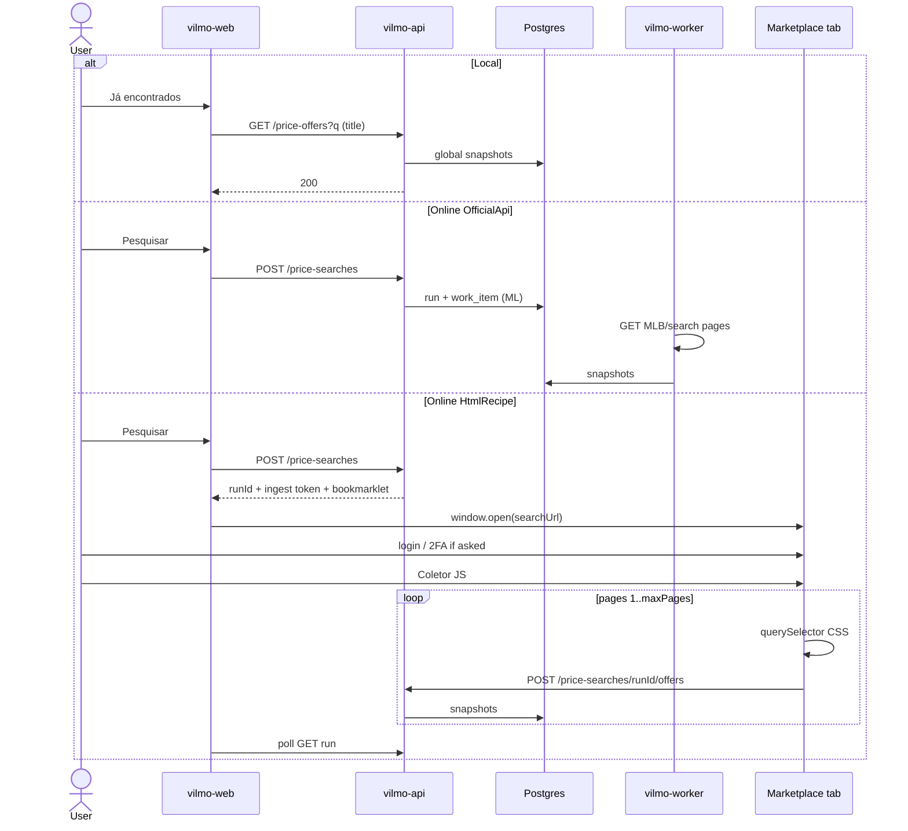

# Plan — Scrap / pesquisa de preços (no implementation)

This is the build plan only. **Do not implement** until a later task explicitly asks. No application code, Docker images, scrapers, or credentials are created in this revision.

Related: marketplace contract [MarketPlaceEngine.MD](./MarketPlaceEngine.MD), engine plan [PLAN.md](./PLAN.md), architecture [ARCHITECTURE.md](./ARCHITECTURE.md), stories [USER_STORIES.md](./USER_STORIES.md). UI: [UI.md](./UI.md).

Portuguese labels in the product. API codes in English.

---

## 1. Goal

Admin and Company users can:

1. Open a **Scrap** screen, type a search string (ex.: `carregador usb c`), and **select one or more sites**.
2. Choose **where** to search with a flag:
   - **On-line** — fetch live now, then **save** what was found.
   - **Já encontrados** — search **only** the table of offers already saved (no outbound HTTP). Instant. Match by **name/title**.
3. On-line uses **two runners**:
   - **Official API** (Mercado Livre public search) → `vilmo-worker` on the server.
   - **HTML sites** (Magalu, Shopee, SHEIN, Joom, Martins, ML fallback) → **JavaScript on the user’s laptop**, on the site’s own tab (after the human logs in, including 2FA). The script sends `PriceOffer` rows to the API to save. The AWS worker does **not** fetch that HTML (avoids cookie paste, Cloudflare IP bind, and server-side 2FA).
4. Persist **every offer found** with **search datetime**, site, title, price, URL, seller, thumbnail, and raw snapshot. Snapshots are **global** (not per company / per user).
5. Show a **comparison table** (types and prices across sites). History compare is **phase 6** (accepted later).
6. Add / edit scrape sites in **Configurações**: URL template, **CSS selectors per item**, optional usuário/senha as a reminder, **Abrir login** on the site, rate / `maxPages` — **without a redeploy**. Empty CSS → **ask** before running.

This is **market research** (what the market is charging). It is **not** Anúncios import, not stock, and not POST `/items`.

---

## 2. Architecture

Unified DTO still lands in the API. **Who fetches HTML** is the user’s browser, not the worker.

A page on `vilmomkt.com` **cannot** `fetch()` Magalu/Shopee (CORS / cookies). The collector must run **inside the marketplace tab** (bookmarklet / one-shot script). That tab already has the user’s login, 2FA, and Cloudflare cookie.

```text
Scrap UI (vilmo-web)
  → Local:  GET /price-offers?q=  (Postgres, global, find-by-name)
  → Online: POST /price-searches → 202 { runId, collectorScripts[] }

  OfficialApi (ML public):
    vilmo-api enqueues work_item
    vilmo-worker GET api.mercadolibre.com/sites/MLB/search
    persist snapshots

  HtmlRecipe (Magalu, Shopee, …):
    UI opens search URL in a new tab  (user logs in there if asked)
    UI shows “Coletor” (bookmarklet / Copiar script)
    User runs JS **on the site tab**
    JS uses Configurações CSS, walks up to maxPages, POSTs offers
      POST /price-searches/{runId}/offers   Bearer ingest token
    vilmo-api saves global snapshots  (no outbound to the site)
```

vilmo-api **never** HTTP-calls Magalu/Shopee/Martins. Worker **only** calls official/public APIs (ML v1). Playwright on the server is deferred.

---

## 3. Fetch mode per site

| Site (v1 seed) | Example search URL | Runner |
| --- | --- | --- |
| Mercado Livre | `https://lista.mercadolivre.com.br/{slug}` | **Worker:** `GET /sites/MLB/search?q=` (public, no seller password, no Anúncios OAuth). HTML collector only if that API is blocked **and** CSS is filled. |
| Shopee | `https://shopee.com.br/search?keyword=` | **Laptop JS** + CSS. |
| Magazine Luiza | `https://www.magazineluiza.com.br/busca/` | **Laptop JS** + CSS. Login on the Magalu tab. |
| SHEIN | `https://br.shein.com/pdsearch/{query}/` | **Laptop JS** + CSS. |
| Joom | `https://joom.pro/pt-br/search?q=` | **Laptop JS** + CSS. |
| Martins Atacado | `https://www.martinsatacado.com.br/busca/` | **Laptop JS** + CSS. Login on the Martins tab. |

Do **not** commit site passwords. Optional usuário/senha in Configurações are a **human reminder** (who to type on the site), not sent to AWS to log in.

Feature flag **per site** (platform-global).

---

## 4. Screens

### 4.1 Menu

| Level | Menu |
| --- | --- |
| Admin, Company | **Scrap** (after Anúncios). Configurações: **Sites de busca**. |
| Vendor | Hidden. |

Route: `#/scrap`. Config: `#/config/scrap-sites`.

### 4.2 Scrap (run a search)

```
┌ Scrap ─────────────────────────────────────────────────────────┐
│ Busca  [ carregador usb c          ]                           │
│ Onde   (•) On-line — buscar agora e gravar                     │
│        ( ) Já encontrados — só a tabela (por título)           │
│ Sites  [x] Mercado Livre  [x] Shopee  [ ] Magalu               │
│        [x] SHEIN  [ ] Joom  [ ] Martins                        │
│ Páginas: máx. de Configurações (padrão 5)                      │
│ [ Pesquisar ]                                                  │
│                                                                │
│ Mercado Livre  ████████░░  24 ofertas · limite de 5 páginas    │
│ Magalu         Abra a aba do site, entre (2FA se pedir),       │
│                depois clique Coletor nesta linha.              │
│                [ Abrir site ]  [ Coletor ]                     │
└────────────────────────────────────────────────────────────────┘
```

**Flag `scope`**

| Value | API | Who fetches | Writes snapshots |
| --- | --- | --- | --- |
| `Online` | `POST /price-searches` → 202 | Worker (OfficialApi) and/or **laptop JS** (HtmlRecipe) | Yes, **global** |
| `Local` | `GET /price-offers` → 200 | Nobody | No |

- Default: **Já encontrados**. Find-by-name on `title`.
- Empty CSS on an HtmlRecipe site: **ask** (“Cadastre os seletores CSS em Configurações para {site}”) and do not start that site. OfficialApi (ML) does not need CSS.
- **Já encontrados** empty: “Nenhuma oferta salva para esta busca. Marque On-line para pesquisar nos sites.”
- Local filters: date de/até, último preço (default on). Date window: **all time**.
- `maxPages` per site (default **5**). Run may only **lower** it.

**Laptop collector (HtmlRecipe On-line)**

1. If CSS empty → ask, skip that site.
2. `window.open(searchUrl)` — user completes login / 2FA / CAPTCHA **on the site** (Vilmo UI does not automate 2FA).
3. User focuses that tab and runs **Coletor** (bookmarklet generated for this `runId` + `siteCode`).
4. Script (marketplace origin): `querySelectorAll(resultListPath)`, map title/price/url, next page or scroll, pause `delayMs`, stop at `maxPages` / empty / no next.
5. `POST /price-searches/{runId}/offers` with a **short-lived ingest token** (not the Vilmo cookie — that cookie is not sent from Magalu). Batches allowed. API maps to `PriceOffer` and inserts snapshots.
6. Scrap UI polls; table fills. User keeps the site tab open until that site’s bar is Done.

Coletor v1 = **bookmarklet** (or “Copiar script” to paste in DevTools). A Chrome extension is **out of v1**.

**Messages (never silent)**

| Situation | Message |
| --- | --- |
| Empty CSS | `Cadastre os seletores CSS em Configurações para {site}.` |
| Waiting for collector | `Abra o site, faça login se pedir, e clique Coletor.` |
| Collector 0 items | `Nenhum item encontrado com os seletores CSS cadastrados.` |
| No next / no page param | `Não foi possível ir além da página 1 neste site.` |
| Hit `maxPages` | `Limite de {n} páginas atingido (Configurações).` |
| User still on login/2FA | `Conclua o login na aba do site e clique Coletor.` |
| Ingest token expired | `Coletor expirou. Clique Coletor de novo nesta busca.` |
| ML API 403/429 | `O site recusou o acesso (HTTP {code}).` |
| robots (OfficialApi/HTML policy) | `Este site não permite coleta automática (robots.txt).` |

### 4.3 Comparison table

Rows = clustered offers. Columns = sites. Global pool.

| Produto (agrupado) | Mercado Livre | Shopee | Magalu | SHEIN | Joom | Martins |
| --- | --- | --- | --- | --- | --- | --- |
| Carregador USB-C 20W | R$ 29,90 Abrir ↗ | R$ 32,00 Abrir ↗ | — | R$ 27,50 Abrir ↗ | — | R$ 24,90 Abrir ↗ |

**Order:** clickable Asc/Desc on title, min price, per-site price, `observedAt`. Default cheapest first.

- Local: `GET /price-offers?sort=&dir=&page=&pageSize=50` (global, title).
- Current run: `GET /price-searches/{runId}` same paging.

**Pagination**

1. **Live:** OfficialApi worker walks ML `offset`/`limit=50`. Laptop collector walks HTML pages / next / scroll up to `maxPages`. Cap → message, not an error.
2. **Table:** 50 saved rows per page. Table page 2 does **not** fetch remote page 2 — **accepted**.

Offer links: `target="_blank"` `rel="noopener noreferrer"`. No iframe of the marketplace.

v1 clustering: normalize title + optional EAN. Fuzzy later — **accepted**.

### 4.4 Configurações — Sites de busca

Platform-global. Admin edits; Company may view.

```
┌ Sites de busca — Magalu ───────────────────────────────────┐
│ [x] ativo     Máx. páginas [ 5 ]                           │
│ Usuário / senha (lembrete para o login na aba do site)     │
│ [ Abrir login do site ]                                    │
│ Seletor da lista de itens  [                    ]          │
│ Seletor do título          [                    ]          │
│ Seletor do preço           [                    ]          │
│ Seletor do link            [                    ]          │
│ … imagem, vendedor, EAN, próxima página …                  │
└────────────────────────────────────────────────────────────┘
```

Admin fills CSS after inspecting the live search page. Vilmo does not invent Magalu/Joom paths. Empty required selectors → **ask** on Pesquisar.

| Field | Purpose |
| --- | --- |
| `code` | `MercadoLivre`, `Shopee`, `Magalu`, `Shein`, `Joom`, `MartinsAtacado` |
| `displayName` | Label |
| `enabled` | Global flag |
| `fetchMode` | `OfficialApi` \| `HtmlRecipe` |
| `searchUrlTemplate` | e.g. `https://joom.pro/pt-br/search?q={query}` |
| `resultListPath` | CSS for **each result item**. Required for HtmlRecipe. |
| `titlePath`, `pricePath`, `urlPath` | CSS relative to item |
| `imagePath`, `sellerPath`, `eanPath` | Optional CSS |
| `maxPages` | Seed **5** |
| `delayMs` | Pause in the **collector** between pages |
| `pageParam` / `nextPagePath` | Page 2+ or CSS for “next” |
| `loginUrl` | Opened by Abrir login / Abrir site |
| `username` / `password` | Optional reminder only. Password `is_secret`, write-only. **Not** used by the worker to log in. |

No `sessionCookie` paste field — the collector runs with the browser’s own cookies on the site tab.

Seed `maxPages=5` (and ML `limit=50`). Do **not** seed CSS, passwords.

---

## 5. Domain

### 5.1 Unified DTO

```text
PriceOffer
  siteCode, remoteId, title, url
  price, currency          // BRL
  sellerName?, thumbnail?
  ean?, condition?, listingType?
  inStock?, shippingPrice?
  observedAt
  snapshotJson             // extract only, no secrets, no full account HTML
```

### 5.2 Persistence — global results

Reads **ignore company and user**. `created_by` on a run is audit only.

| Table | Role |
| --- | --- |
| `scrape_site` | Platform catalog |
| `scrape_site_parameter` | Global CSS + optional reminder secrets |
| `price_search_run` | `id`, `query`, `started_at`, `created_by` (audit) |
| `price_search_run_site` | status, offer_count, message |
| `price_offer_snapshot` | unique `(run_id, site_code, remote_id)` — **no company filter** |
| `price_search_log` | progress + collector events |
| `price_search_ingest_token` | short-lived token per `(runId, siteCode)` for the bookmarklet |

**Local query:** global snapshots, selected sites, **title** `ILIKE` tokens (find-by-name). Optional EAN if the query is digits. Limit 400. Latest `observed_at` per `(site_code, remote_id)` for cells.

Do **not** write `InventoryBalance` or `Listing`. Do not snapshot seller-private account pages.

### 5.3 Work

```text
WorkKinds.PriceSearch = "price.search.requested"   // OfficialApi sites only
Payload: { runId, siteCode, query, pages, actorUserId }
```

HtmlRecipe sites **do not** enqueue worker jobs. They wait for `POST .../offers` from the laptop.

---

## 6. Helpers

**Worker (OfficialApi only)**

| Helper | Does |
| --- | --- |
| `OfficialSearchHelper` | ML `offset`/`limit` loop until empty, total, or maxPages |
| `PriceNormalizer` | `R$ 1.234,56` → `1234.56` |
| `RateLimiter` | 429 backoff for official APIs |

**Laptop collector (served by vilmo-web, runs on the site origin)**

| Helper | Does |
| --- | --- |
| `PriceSearchCollector` | Bookmarklet: CSS query, pagination/scroll, ingest POST |
| `PriceNormalizer` (same rules, JS) | Keep BRL parsing consistent with the server |

**ML v1:** `GET https://api.mercadolibre.com/sites/MLB/search?q={query}&offset={n}&limit=50` without Marketplaces OAuth. Cap → Done + limite message. Seller password unused. Anúncios OAuth is a separate reconnect.

---

## 7. Sequence



Ingest: Idempotency-Key optional; dedupe `(run_id, site_code, remote_id)`. Token TTL ~30 min, bound to `runId`+`siteCode`. CORS: allow POST from the seeded site origins **or** no CORS needed if the bookmarklet uses a form/img beacon — prefer CORS allowlist + Bearer token (no cookies).

---

## 8. API (sketch)

| Method | Path | Result |
| --- | --- | --- |
| `POST` | `/price-searches` | 202 `{ runId, query, sites: [{ code, runner: "Worker"\|"Collector", searchUrl, bookmarklet?, ingestToken? }] }` |
| `POST` | `/price-searches/{runId}/offers` | 204. Body `{ siteCode, offers: PriceOffer[], page, done?, message? }`. Auth: ingest token. |
| `POST` | `/price-searches/{runId}/collector-log` | 204 progress line from the laptop |
| `GET` | `/price-offers` | Local table, title `q`, **no company filter** |
| `GET` | `/price-searches` | Previous runs (global) |
| `GET` | `/price-searches/{runId}` | Status + offers + messages |
| `GET` | `/price-search-logs?runId=` | Logs |
| `GET`/`PUT`/`POST` | `/scrape-sites` | Global CSS + `maxPages` + reminder username; password write-only |

Admin/Company allowed. Vendor 404. Demo tokens must not start collectors against real sites.

---

## 9. Legal, abuse, and ops

- Official API: honor 429. HTML: the user is browsing as themselves; still cap `maxPages` and `delayMs` in the collector.
- If robots.txt would block a **server** fetch, still show the robots message for OfficialApi. Laptop collector is a user-driven browse; do not pretend it is anonymous.
- Snapshots = offer list DTO, not full logged-in account HTML.
- Ingest token in the bookmarklet is a secret: short TTL, one run, do not log it. GET never returns password.

---

## 10. Phased delivery (when implementation is requested)

1. Tables + Scrap UI + global Local GET (find-by-name) + Configurações CSS fields + empty-CSS **ask** + messages.
2. ML worker public search → global snapshots; Local finds by title with zero ML HTTP.
3. Laptop collector: bookmarklet + `POST .../offers` + Abrir site + login on the site tab.
4. Remaining HtmlRecipe sites as CSS is filled (admin later).
5. History compare — later (**accepted**).

Success for phase 2: On-line `carregador usb` + ML → prices + permalinks, stock unchanged, any Admin/Company sees the rows. Já encontrados by title → same rows, zero ML HTTP.

Success for phase 3: Magalu (or Joom) with CSS filled → user logs in on the Magalu tab → Coletor → rows in the **same** global table, **zero** Magalu HTTP from AWS.

---

## 11. Out of scope

- Changing stock or sale price from scraped numbers.
- Publishing/pausing ads from Scrap.
- Chrome extension (v1 = bookmarklet / DevTools script).
- Automating 2FA inside Vilmo.
- Worker fetching Magalu/Shopee HTML or using pasted cookies.
- Reading HttpOnly cookies from a third-party tab into `#/config`.
- Playwright on the server.
- Fuzzy clustering, alerts, scheduled On-line, Vilmo catalog in the table.
- Per-company isolation of results.

---

## 12. Open decisions (implementation time)

- Bookmarklet vs “Copiar script” vs both (both is cheap; bookmarklet is the named v1).
- Infinite-scroll sites: collector `scrollIntoView` loop vs `nextPagePath` only.
- CORS allowlist of marketplace origins on the ingest endpoint vs a Vilmo-owned `postMessage` bridge (bookmarklet on site → `window.opener` on vilmomkt). **Prefer ingest POST + CORS allowlist** so the user can close Scrap and still finish; if CORS is refused, fall back to `postMessage` to the opener.

---

## 13. Status and gaps (plan only — nothing is built)

**How it is going:** document only. **Do nothing for now.** Configurações is still only A1. Empty first ship is **accepted**.

### Decided

- On-line vs Já encontrados; empty Local until first save — **ok**.
- Find-by-name (`ILIKE` title) — **ok**.
- Global snapshots — **ok**. Do not snapshot private account pages.
- CSS fields; empty → **ask**; admin fills later — **ok**.
- HTML scrape on the **laptop** (JS on the site tab) → POST offers to the API. Login / 2FA on the **user UI** (site tab). No cookie paste. No worker HTML. No worker IP vs Cloudflare for those sites.
- ML v1 = public search API; seller password unused; Anúncios OAuth separate — **ok**.
- Messages for cap, no-next, 403, empty CSS.
- Table paging ≠ remote paging — **ok**.
- History compare = phase 6 — **ok**.
- Weak title grouping in v1 — **ok**.

### Remaining gaps (still real)

| Gap | Why it still matters |
| --- | --- |
| **Not implemented** | Accepted; still no Scrap in the app. |
| **Collector is a manual click** | JS on `vilmomkt.com` cannot read Magalu DOM (CORS). The user must open the site tab, log in, and run **Coletor** there. Closing the tab early stops that site. |
| **CSS still empty until you add it** | Ask-and-skip; 0 rows until selectors work. |
| **Some sites block bookmarklets / CSP** | Rare, but then “Copiar script” in DevTools Console, or a later extension. |
| **CORS on ingest** | Magalu origin POSTing to vilmomkt.com needs an allowlist (or `postMessage` fallback). Until that is wired, the laptop cannot save. |
| **Collector cannot run unattended** | No overnight Magalu scrape from AWS. OfficialApi (ML) can still run in the worker without the laptop. |

### Acceptable to defer

- History compare, fuzzy match, Chrome extension, Playwright, scheduled jobs, price alerts, Vilmo SKUs in the table.

### What “done” is *not*

Anúncios ML import does not fill Scrap. Expired Marketplaces OAuth does not block ML public search.
