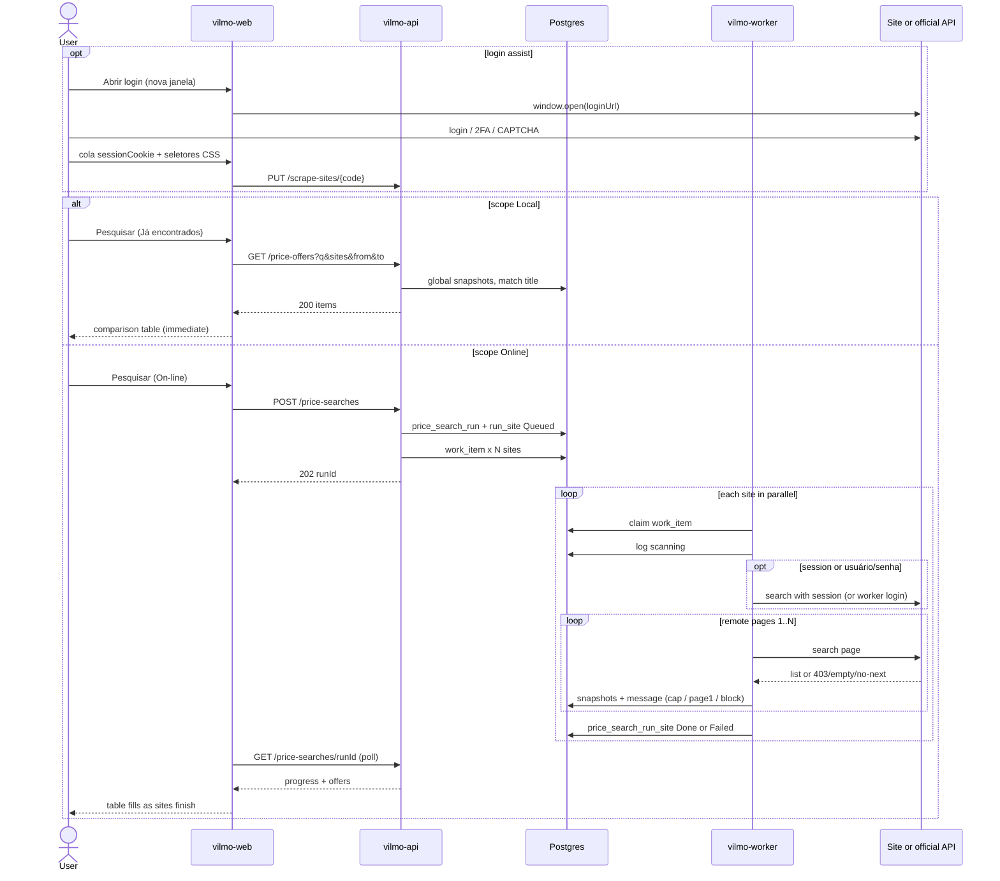

# Plan — Scrap / pesquisa de preços (no implementation)

This is the build plan only. **Do not implement** until a later task explicitly asks. No application code, Docker images, scrapers, or credentials are created in this revision.

Related: marketplace contract [MarketPlaceEngine.MD](./MarketPlaceEngine.MD), engine plan [PLAN.md](./PLAN.md), architecture [ARCHITECTURE.md](./ARCHITECTURE.md), stories [USER_STORIES.md](./USER_STORIES.md). UI: [UI.md](./UI.md).

Portuguese labels in the product. API codes in English.

---

## 1. Goal

Admin and Company users can:

1. Open a **Scrap** screen, type a search string (ex.: `carregador usb c`), and **select one or more sites**.
2. Choose **where** to search with a flag:
   - **On-line** — fetch live pages/APIs now (parallel workers), then **save** what was found.
   - **Já encontrados** — search **only** the table of offers already saved (no outbound HTTP). Instant. Match by **name/title**.
3. On-line: each selected site is fetched **in parallel**. The screen shows per-site progress as results arrive — same pattern as NF-e ingest and Anúncios import logs. Limits and blocks surface as **plain messages** (never silent).
4. Persist **every offer found** with **search datetime**, site, title, price, URL, seller, thumbnail, and raw snapshot. Snapshots are **global** (not per company / per user).
5. Show a **comparison table** (types and prices across sites) and keep history so the same query can be compared over time (history compare is **phase 6**, accepted later).
6. Add / edit scrape sites in **Configurações**: URL template, **CSS selectors per item**, **usuário / senha**, **Abrir login** on a separate page (2FA/CAPTCHA on the site itself), rate limits — **without a redeploy**.

This is **market research** (what the market is charging). It is **not** Anúncios import (seller’s own listings), not stock, and not POST `/items`.

---

## 2. Why helpers, not a scraper per site in the UI

The marketplace rule stays for **search**: **vilmo-web does not scrape Magalu/Shopee/ML HTML**. Core/UI enqueues; adapters run in `vilmo-worker`.

**Exception (login assist only):** Configurações may **open the site’s login URL in a new window** so a human completes login / 2FA / CAPTCHA on the marketplace page. After that, they paste the session (cookie) and CSS selectors back into Vilmo. The Scrap screen still never fetches competitor HTML.

```text
Scrap UI (vilmo-web)
  → flag scope = Online | Local
  → Online: POST /price-searches  { query, siteCodes[], scope: "Online" }  → 202 { runId }
       poll GET /price-searches/{runId} + /price-search-logs
  → Local:  GET  /price-offers?q=&sites=&from=&to=   → 200 { items, counts }  (Postgres only, **global**)
  → unified OfferDTO
vilmo-api: ACK fast; **never** HTTP to the target sites (including Local)
vilmo-worker: one job per (runId, siteCode), in parallel
  → IPriceSearchAdapter.SearchAsync(ctx)
       Official API adapter  (preferred: ML public search)
       HtmlRecipe helper     (CSS driven by Configurações fields the admin fills)
       Browser helper        (Playwright, last resort, isolated)
  → persist **global** snapshots
```

**Helpers** are reusable building blocks. A new site is mostly a **row + CSS fields**, not a new C# project. A compiled adapter is only for sites that already have a stable official API.

---

## 3. Official API first, HTML second, browser last

HTML scraping of storefront search pages is **fragile** (Cloudflare, JS render, layout changes) and often **against the site’s terms**. Prefer public/partner APIs when they work without seller OAuth.

| Site (v1 seed) | Example search URL (query = `carregador usb`) | Planned fetch mode |
| --- | --- | --- |
| Mercado Livre | `https://lista.mercadolivre.com.br/{slug}` | Prefer official `GET /sites/MLB/search?q=` (public search, no seller OAuth). If blocked, HtmlRecipe using Configurações CSS + session from **Abrir login**. Anúncios OAuth is a **different** reconnect. |
| Shopee | `https://shopee.com.br/search?keyword=` | HtmlRecipe + CSS fields after session; Open Platform later if app keys exist. |
| Magazine Luiza | `https://www.magazineluiza.com.br/busca/` | HtmlRecipe + CSS fields; login via **Abrir login** / usuário/senha. |
| SHEIN | `https://br.shein.com/pdsearch/{query}/` | HtmlRecipe + CSS fields; JS-heavy — Browser only if CSS yields nothing. |
| Joom | `https://joom.pro/pt-br/search?q=` | HtmlRecipe; admin fills CSS for each item. |
| Martins Atacado | `https://www.martinsatacado.com.br/busca/` | B2B: **Abrir login** (or usuário/senha) then CSS recipe. |

**Do not commit** any site email/password into the repo, env samples, or this document. Admin enters them in Configurações (`username` + `password` with `is_secret`). Worker never echoes passwords in logs or snapshots.

Feature flag **per site** (platform-global). Not per company.

---

## 4. Screens

### 4.1 Menu

| Level | Menu |
| --- | --- |
| Admin, Company | **Scrap** (after Anúncios). Configurações gains **Sites de busca**. |
| Vendor | Hidden (research tool, not the storefront role). |

Route: `#/scrap`. Config sites: `#/config/scrap-sites`. Login assist: `#/config/scrap-sites/{code}/login`.

### 4.2 Scrap (run a search)

```
┌ Scrap ─────────────────────────────────────────────────────────┐
│ Busca  [ carregador usb c          ]                           │
│ Onde   (•) On-line — buscar agora nos sites e gravar           │
│        ( ) Já encontrados — só a tabela salva (por título)     │
│ Sites  [x] Mercado Livre  [x] Shopee  [ ] Magalu               │
│        [x] SHEIN  [ ] Joom  [ ] Martins                        │
│ Páginas on-line: cada site usa o máx. de Configurações         │
│   (padrão 5; opcional: limitar esta busca a [ _ ] páginas)     │
│ [ Pesquisar ]                                                  │
│                                                                │
│ ── se On-line ──────────────────────────────────────────────── │
│ Mercado Livre  ████████░░  24 ofertas · 13:40:02               │
│                Limite de 5 páginas atingido (Configurações).   │
│ Shopee         ██████░░░░  consultando…                        │
│ SHEIN          ░░░░░░░░░░  O site recusou o acesso (HTTP 403). │
│                                                                │
│ Comparar  (tabela)     Histórico desta busca                   │
└────────────────────────────────────────────────────────────────┘
```

**Flag `scope` (UI copy: “Onde”)**

| Value | API | Worker | Writes snapshots | Progress bars |
| --- | --- | --- | --- | --- |
| `Online` | `POST /price-searches` → 202 | Yes, one job per site | Yes (**global** table) | Yes |
| `Local` | `GET /price-offers?...` → 200 | No | No | No — table fills immediately |

- Default: **Já encontrados** when opening Scrap (cheap, no rate limits). User switches to **On-line** when they want fresh prices.
- Site checkboxes apply to **both** modes (Local filters `site_code IN (...)`).
- Selecting a site that is disabled or missing required CSS (`resultListPath` empty on HtmlRecipe) → checkbox disabled + hint (“Cadastre os seletores em Configurações”). On Local, a site with **no saved rows** is still selectable; the column shows “—”.
- **On-line Pesquisar** → `202` immediately; progress rows update as each site job finishes (poll 2s, same as import logs).
- **Já encontrados Pesquisar** → no queue. Empty result: “Nenhuma oferta salva para esta busca. Marque On-line para pesquisar nos sites.”
- Local extras (filters on the table, not a second search): date **de / até** (`observedAt`), **último preço por anúncio** (default on) vs **histórico**. Default date window: **all time** (global pool).
- On-line **Páginas**: each ticked site walks **its own** `maxPages` from Configurações (**default 5**). An optional per-run field may **lower** that for this search only; it cannot exceed the site’s configured `maxPages`. Progress can show `página 2/5`.

**User-facing messages (required — never fail silent)**

| Situation | Message (pt-BR, progress row) |
| --- | --- |
| `robots.txt` deny | `Este site não permite coleta automática (robots.txt).` |
| HTTP 403 | `O site recusou o acesso (HTTP 403).` |
| HTTP 401 / login HTML | `Sessão expirada. Abra o login em Configurações e cole a sessão.` |
| HTTP 429 | `O site limitou as consultas (HTTP 429). Tente mais tarde.` |
| Timeout | `O site não respondeu a tempo.` |
| CSS matched 0 items | `Nenhum item encontrado com os seletores CSS cadastrados.` |
| No `page=` / no `next` | `Não foi possível ir além da página 1 neste site.` |
| Hit `maxPages` | `Limite de {n} páginas atingido (Configurações).` |
| 2FA / CAPTCHA page | `O site pediu verificação extra. Abra o login em uma página separada.` |
| Bad password (worker login) | `Revise usuário e senha em Configurações.` |

Other sites keep running when one fails.

### 4.3 Comparison table

Rows = clustered offers for this `runId` (and optionally previous **global** runs of the same title search). Columns = sites.

| Produto (agrupado) | Mercado Livre | Shopee | Magalu | SHEIN | Joom | Martins |
| --- | --- | --- | --- | --- | --- | --- |
| Carregador USB-C 20W | R$ 29,90 Abrir ↗ | R$ 32,00 Abrir ↗ | — | R$ 27,50 Abrir ↗ | — | R$ 24,90 Abrir ↗ |
| … | | | | | | |

Each cell: **price** (clickable), optional seller, **open-in-new-window link**, observed-at.

**Order (Asc / Desc)** — clickable column headers, not a fixed sort.

| Column | Sorts by |
| --- | --- |
| Produto | Grouped title A–Z / Z–A |
| Preço (mín. entre sites) | Lowest (or highest) price among ticked sites in that row |
| Each site column | That site’s price (`—` last) |
| Atualizado | `observedAt` |

Default: **Preço mín. Asc** (cheapest first). One active column at a time; second click toggles Asc ↔ Desc. Arrow on the header (▲ / ▼).

- **Local:** `GET /price-offers?sort=…&dir=…&page=1&pageSize=50` (server-side, **global**).
- **On-line (current run):** same on `GET /price-searches/{runId}`.

**Pagination (two layers)**

1. **Live / remote (worker, On-line only)** — walk the marketplace search **pages** until `pages` requested, `maxPages` cap, empty page, or `paging.total` reached. Each page respects `delayMs`. Adapters **must** paginate; a single HTTP call is not enough.
   - Mercado Livre: `GET /sites/MLB/search?q=&offset=&limit=50` using `paging.total`.
   - Official JSON: `OfficialSearchHelper` loops offset/cursor from the recipe (`pageParam` / `offsetParam` / `cursorPath`).
   - HtmlRecipe: `{page}` in `searchUrlTemplate` or `nextPagePath` (CSS/rel=next). Stop on duplicate `remoteId`s or empty list. If neither `page` nor `next` exists → **page 1 only** + message `Não foi possível ir além da página 1 neste site.`
   - Browser: same stop rules; no infinite scroll into thousands of SKUs in v1.
2. **Table (UI)** — the comparison grid is paged: **50 rows per page**, Página anterior / seguinte, “Mostrando 1–50 de 180”. Sort/filter resets to page 1. This applies to **both** On-line (after snapshots land) and Já encontrados.

v1 does **not** fetch the entire marketplace catalog. Live search is “up to N pages per site”, then the table pages through **what was saved**. Hitting the cap is **success with a message**, not an error.

**Open in a new window:** every offer `url` / permalink is `<a href="…" target="_blank" rel="noopener noreferrer">`. Label: price text plus **Abrir**. Missing URL → price as plain text, no link. Do **not** embed the marketplace in an iframe.

Filters (unchanged): site, min/max BRL, only in-stock if the snapshot has it.

v1 clustering: normalize title (lowercase, strip accents, collapse whitespace) + optional EAN/GTIN when the page/API exposes it. v2: fuzzy / embedding — out of this plan (**accepted**; refine later).

### 4.4 Configurações — Sites de busca

**Platform-global** (Admin edits recipes and credentials; Company may view). One card per site.

```
┌ Sites de busca ────────────────────────────────────────────┐
│ Mercado Livre                          [x] ativo           │
│ Usuário  [                      ]                          │
│ Senha    [                      ]   (nunca exibida de novo)│
│ Máx. páginas  [ 5 ]                                        │
│ [ Abrir login em nova página ]                             │
│ Sessão / cookie  [ ________________ ]  (colar após o login)│
│                                                            │
│ Seletor da lista de itens  [ .ui-search-result  ]          │
│ Seletor do título          [ .ui-search-item__title ]      │
│ Seletor do preço           [ .price-tag-fraction    ]      │
│ Seletor do link            [ a.ui-search-link       ]      │
│ … imagem, vendedor, EAN, próxima página …                  │
└────────────────────────────────────────────────────────────┘
```

The **admin fills CSS selectors** after inspecting the live search page (DevTools). Vilmo does not invent Magalu/Joom paths. Empty required selectors → site cannot be ticked on Scrap until filled (OfficialApi sites like ML public search skip CSS).

Fields:

| Field | Purpose |
| --- | --- |
| `code` | Stable id: `MercadoLivre`, `Shopee`, `Magalu`, `Shein`, `Joom`, `MartinsAtacado` |
| `displayName` | Label on Scrap |
| `enabled` | Feature flag (global) |
| `fetchMode` | `OfficialApi` \| `HtmlRecipe` \| `Browser` |
| `searchUrlTemplate` | e.g. `https://joom.pro/pt-br/search?q={query}` |
| `resultListPath` | **CSS selector for each result item** (the list row). Required for HtmlRecipe. |
| `titlePath` | CSS (relative to item) for the product name |
| `pricePath` | CSS for the price text |
| `urlPath` | CSS for the offer permalink |
| `imagePath`, `sellerPath`, `eanPath` | Optional CSS |
| `maxPages` | Hard cap on live pages **per site**. Seed **5**. Worker uses `min(pagesRequested, maxPages)`. |
| `delayMs` | Pause between remote pages (e.g. ≥ 1000 ms) |
| `pageParam` / `offsetParam` / `limitParam` | How the live URL encodes page 2+ (`offset`, `page`, `cursor`) |
| `pageSize` | Remote page size (e.g. ML 50) |
| `nextPagePath` | Optional CSS/JSON path to “next” when there is no page number |
| `respectRobots` | Default true |
| `username` | Site login (email / CPF / CNPJ). Platform-global. Empty = try session cookie or public search. |
| `password` | Site login password. `is_secret`. **Write-only** in the UI. |
| `loginUrl` | Marketplace login page opened by **Abrir login**. |
| `loginUsernameSelector` | CSS of the login user field (optional; for worker auto-login when there is no 2FA). |
| `loginPasswordSelector` | CSS of the login password field |
| `loginSubmitSelector` | CSS of the login submit button |
| `sessionCookie` | Session after human or worker login. `is_secret`. **Editable**: paste after **Abrir login**. |

**Adicionar site** creates a new `code` at runtime. Worker uses `HtmlRecipe` unless `fetchMode` is OfficialApi and a compiled adapter exists for that code.

#### Login assist (separate page)

2FA / CAPTCHA / Cloudflare challenges are **not** automated inside Scrap. The human completes them on the **site’s own page**.

```
┌ Login do site — Magalu ────────────────────────────────────┐
│ 1. Clique em Abrir login (nova janela).                    │
│ 2. Entre no site, inclusive verificação extra se pedir.    │
│ 3. Volte aqui e cole o cookie / sessão.                    │
│ 4. (Opcional) no DevTools, copie os seletores CSS          │
│    da lista de produtos e grave no card do site.           │
│ [ Abrir login ]     Cookie [ ________________ ] [ Salvar ] │
└────────────────────────────────────────────────────────────┘
```

```text
[ Abrir login ] → window.open(loginUrl)  target=_blank  rel=noopener
```

- Vilmo **cannot** read HttpOnly cookies from that third-party tab (browser same-origin rules). The user **pastes** `sessionCookie` (Cookie header value, or `name=value; name2=value2`).
- Worker uses pasted session on every search request. If 401 / login HTML: message to open login again; do not loop.
- If `username`+`password`+login CSS are set **and** no challenge is expected, worker may POST login itself and store `sessionCookie` (no 2FA). Human paste wins if both exist and session is fresh.
- Never log the password or the full cookie; mask username.

Seed `scrape_site_parameter` (editable later). **Do not seed passwords, cookies, or site-specific CSS** — those are filled in Configurações.

| site | key | value | is_secret |
|------|-----|-------|-----------|
| Mercado Livre | `maxPages` | `5` | false |
| Mercado Livre | `limit` | `50` | false |
| Shopee / Magalu / SHEIN / Joom / Martins | `maxPages` | `5` | false |
| all HtmlRecipe sites | `resultListPath`, `titlePath`, `pricePath`, `urlPath` | empty until admin fills | false |
| all sites | `username` / `password` / `sessionCookie` | empty | password and session true |

---

## 5. Domain

### 5.1 Unified DTO (internal)

```text
PriceOffer
  siteCode, remoteId, title, url
  price, currency          // BRL
  sellerName?, thumbnail?
  ean?, condition?, listingType?
  inStock?, shippingPrice?
  observedAt               // UTC from worker
  snapshotJson             // raw API/HTML extract, no secrets
```

UI and comparison tables only read this DTO. Adapters never leak into `vilmo-web`.

### 5.2 Persistence (Postgres) — global results

Scrap **ignores company and user** when reading offers. Any Admin/Company search sees the same pool. `created_by` / `company_id` on a run are **audit only**.

| Table | Role |
| --- | --- |
| `scrape_site` | Platform catalog of sites (not copied per tenant) |
| `scrape_site_parameter` | Global recipe + secrets (`is_secret`) |
| `price_search_run` | `id`, `query`, `started_at`, `created_by` (audit), optional `company_id` (audit only — **not** used on GET) |
| `price_search_run_site` | `run_id`, `site_code`, `status`, `http_status`, `offer_count`, `error` (user-facing message code + detail) |
| `price_offer_snapshot` | One row per offer: `run_id`, `site_code`, `remote_id`, fields above. **No company filter.** Unique `(run_id, site_code, remote_id)` |
| `price_search_log` | Progress steps including the messages in §4.2 |

History: each **On-line** run inserts new snapshots (append-only, global). Local never inserts. Comparing “today vs last week” is phase 6.

**Local query (v1):** global `price_offer_snapshot` where:

- selected `site_code`s, and
- **title** `ILIKE` the typed tokens (name/title search). Optional EAN exact match if the query looks like digits.

Indexes: `(site_code, observed_at)`, `title` (v1 `ILIKE` + limit 400). No `company_id` on the read path.

Default cell for comparison: **latest** `observed_at` per `(site_code, remote_id)` so the table is not one row per scrape.

Do **not** write `InventoryBalance` or `Listing`. Local search does **not** read `product` / `advertisement`.

### 5.3 Work

```text
WorkKinds.PriceSearch = "price.search.requested"
Payload: { runId, siteCode, query, pages, actorUserId }
```

API inserts **one work item per selected site**. Worker `DrainAsync` already takes 20 pending items — that is the fan-out. Optional later: Redis concurrency cap per site (`delayMs`, circuit breaker).

---

## 6. Adapter + helpers (worker)

```text
IPriceSearchAdapter
  string SiteCode { get; }
  Task<IReadOnlyList<PriceOffer>> SearchAsync(PriceSearchContext ctx, ct)

PriceSearchContext
  Query, SearchUrl, Session?, Username?, Password?, Recipe (CSS fields), MaxPages, PagesRequested, Delay
```

| Helper (in-process, not a deployable) | Does |
| --- | --- |
| `SearchUrlBuilder` | `{query}` / `{slug}` encoding per site |
| `OfficialSearchHelper` | GET + **page/offset/cursor loop** until empty, total, or max pages |
| `HtmlRecipeParser` | AngleSharp (or similar) + Configurações CSS paths |
| `JsonLdProductParser` | `application/ld+json` Product/Offer |
| `PriceNormalizer` | `R$ 1.234,56` → `1234.56` BRL |
| `RobotsChecker` | Cache robots.txt; skip if disallowed → message |
| `RateLimiter` | Per siteCode, honor `delayMs` / 429 |
| `SiteLoginHelper` | Worker POST login when login CSS + usuário/senha and no challenge; else use pasted `sessionCookie` |
| `BrowserSearchHelper` | Playwright **only** if `fetchMode=Browser`; dedicated optional process later |

**Mercado Livre v1 adapter (reference implementation):** `GET https://api.mercadolibre.com/sites/MLB/search?q={query}&offset={n}&limit=50` **without** Marketplaces OAuth (public search). Loop while `offset + limit < paging.total` and page count ≤ `min(pagesRequested, maxPages)`. Map `results[].id, title, price, permalink, thumbnail, seller`. If public search is blocked, fall back to HtmlRecipe + session from login assist. Expired Anúncios OAuth must **not** block Scrap. Hitting `maxPages` → Done + `Limite de {n} páginas atingido (Configurações).`

Generic `HtmlRecipeAdapter` implements `IPriceSearchAdapter` for any `code` whose `fetchMode=HtmlRecipe`. Compiled adapters register by `SiteCode` and win over the generic one.

---

## 7. Sequence



HTTP handler: **no** outbound fetch. Idempotency-Key on POST (Online only). Dedupe snapshots by `(run_id, site_code, remote_id)`. Local GET is read-only, **global**, and not idempotent.

---

## 8. API (sketch)

| Method | Path | Result |
| --- | --- | --- |
| `POST` | `/price-searches` | 202 `{ runId, query, sites[] }` body `{ query, siteCodes[], scope: "Online", pages? }`. `pages` clamped to each site’s `maxPages`. `scope: "Local"` on POST is **400** — use GET. |
| `GET` | `/price-offers` | 200 `{ items, counts, page, pageSize, total }` query `q` (title), `sites`, `from`, `to`, `latestOnly=true`, `sort`, `dir`, `page`, `pageSize`. **No company filter.** |
| `GET` | `/price-searches` | Previous **On-line** runs (datetime, query, offer counts) — global |
| `GET` | `/price-searches/{runId}` | Run + per-site status + offers + **messages** |
| `GET` | `/price-search-logs?runId=` | Progress log (Online only) |
| `GET` | `/scrape-sites` | Global sites + whether CSS recipe is complete + `username` + `passwordSet` + `sessionSet` (never secrets) |
| `PUT` | `/scrape-sites/{code}` | Global parameters: CSS fields, `username`, `password` (write-only), `sessionCookie` (write-only), `maxPages` |
| `POST` | `/scrape-sites` | Admin: register a new `code` |

Admin and Company → allowed. Vendor → 404. Demo tokens must not hit real sites (same rule as ML import).

---

## 9. Legal, abuse, and ops

- Respect `robots.txt` when `fetchMode` is Html/Browser; if denied, **show the robots message** and skip (do not scrape anyway).
- Identify Vilmo with a contactable User-Agent on HTML mode.
- Cap `maxPages` (seed **5** per site) and `delayMs` (e.g. ≥ 1000 ms). Show the cap message when hit.
- Circuit breaker per site: consecutive 403/429 → skip until cooldown + 403/429 message.
- Store snapshots, not full HTML dumps of logged-in account pages, if we can extract the list JSON instead.
- Secrets only in `scrape_site_parameter` (`password`, `sessionCookie`). GET returns `passwordSet` / `sessionSet`, never the secret. Rotate any password that was pasted into chat.

---

## 10. Phased delivery (when implementation is requested)

1. **Tables + Scrap UI + global Local GET** — query by **title**, On-line / Já encontrados, site checkboxes, empty table OK, Configurações CSS fields + usuário/senha + **Abrir login** page, `maxPages = 5`, message strings wired even if unused.
2. **Mercado Livre public search adapter** — On-line fills **global** snapshots without Marketplaces OAuth; Local finds by title with zero ML HTTP. Cap message when `maxPages` hit.
3. **HtmlRecipeParser** — admin-supplied CSS; 0 matches → seletor message; no next page → página 1 message.
4. **Login assist + session cookie** — Abrir login + paste session; worker attaches cookie. 401 → sessão expirada message.
5. **Shopee / Magalu / SHEIN / Joom / Martins** as HtmlRecipe once CSS+session exist; Browser only if CSS yields nothing.
6. **History compare** — later (**accepted**).

Success for phase 2:

- On-line `carregador usb` + Mercado Livre → offers with price + permalink, `observedAt` set, stock **unchanged**, snapshots visible to any Admin/Company.
- Já encontrados with the same string (title) → same rows from Postgres, **zero** outbound ML HTTP.

---

## 11. Out of scope

- Changing `InventoryBalance` / sale price from scraped numbers (a later “sugerir preço” can read snapshots).
- Publishing or pausing ads from Scrap.
- Scraping competitor HTML **from** vilmo-web (except opening login URL). No browser extension in v1.
- Automating 2FA/CAPTCHA **inside** Vilmo (the human does it on the site’s page).
- Reading HttpOnly cookies from a third-party tab without paste.
- A new microservice per site.
- Fuzzy clustering, alerts, or scheduled recurring On-line searches (natural follow-ups after v1).
- Searching Vilmo `product` / `advertisement` in Local mode.
- Per-company isolation of Scrap results.

---

## 12. Open decisions (resolve at implementation time)

- Session paste format: Cookie header string (`a=1; b=2`) vs JSON map — **default Cookie header** unless a site needs extra headers (`authorization`).
- Whether Magalu/Shopee/SHEIN wait for Open API apps vs HtmlRecipe after session vs Browser.
- Session TTL: treat as valid until 401 (no guessed expiry).

---

## 13. Status and gaps (plan only — nothing is built)

**How it is going:** architecture is decided and written. **No Scrap screen, APIs, tables, or adapters exist in the running app.** Configurações today is only A1 certificate. Empty first ship is **accepted**.

### Decided (in this plan)

- Dual search flag: **On-line** vs **Já encontrados**. Empty Local until the first successful On-line run — **accepted**.
- Local match: **name/title** (`ILIKE` on `title`).
- Snapshots and Local reads are **global** (ignore company/user). Credentials and CSS recipes are **platform-global** (Admin).
- Comparison table: Asc/Desc; cheapest first; Abrir in a new tab.
- Two-layer pagination; table page 2 does not fetch remote page 2 — **accepted**.
- Admin fills **CSS selectors** per item (`resultListPath`, `titlePath`, `pricePath`, …) and optional login-field CSS.
- **Abrir login** in a separate window; human completes 2FA/CAPTCHA; **paste session cookie**. Scrap does not wait on Anúncios OAuth.
- Blocks, no-pagination, and 5-page cap → **explicit messages**, not silent stop.
- History compare = phase 6 — **accepted**.
- v1 grouping = title normalize + optional EAN; fuzzy later — **accepted**.
- Vendor hidden; stock / ads not written.

### Remaining gaps (still real)

| Gap | Why it still matters |
| --- | --- |
| **Not implemented** | Plan file only. Accepted as “do later”; Scrap still does not exist in the app. |
| **CSS starts empty** | Fields exist, but Magalu/Joom/Martins will return 0 items until someone pastes working selectors. Empty recipe → site disabled + hint. |
| **Cannot auto-read cookies from the login tab** | Browser same-origin: Vilmo cannot scrape Magalu cookies from `window.open`. User must **paste** the session. Wrong paste → 401 message. |
| **Session from the user’s PC vs worker IP** | Cookie captured in Chrome on a laptop often fails on the AWS worker (Cloudflare / IP bind). Then 403 message. Fix would be Browser helper on the server (deferred) or a fresh paste after the site allows the server. |
| **Worker still cannot solve 2FA** | Separate page only helps if the human pastes a session the **worker** can reuse. If the session is device-bound, HtmlRecipe stays blocked. |
| **ML public search vs seller password** | MLB `GET /sites/MLB/search` still does not use the ML account password. Password + Abrir login are only for HTML fallback. Anúncios OAuth remains a separate reconnect. |
| **ILIKE title** | Accents/typos still miss. Accepted as “find by name/title”; no FTS yet. |
| **Global data is shared** | Company A’s On-line run is visible to Company B. Intentional. Do not put seller-private account pages into snapshots. |

### Gaps that are acceptable to defer

- History compare (phase 6).
- Fuzzy / embedding match.
- Playwright browser helper (until pasted session + CSS cannot run from the worker IP).
- Scheduled On-line refresh, price alerts, “sugerir preço”.
- Include Vilmo catalog SKUs in the same table.
- Browser extension to copy cookies without paste.

### What “done” is *not*

Live import of **your** ML ads (Anúncios) is a different feature and does not populate Scrap snapshots. A user who only imported ads still has an **empty** Já encontrados table until they run Scrap On-line. Expired Marketplaces OAuth does **not** block Scrap ML public search.
