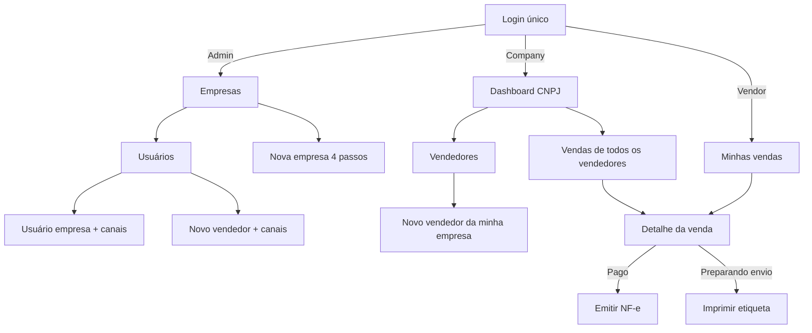
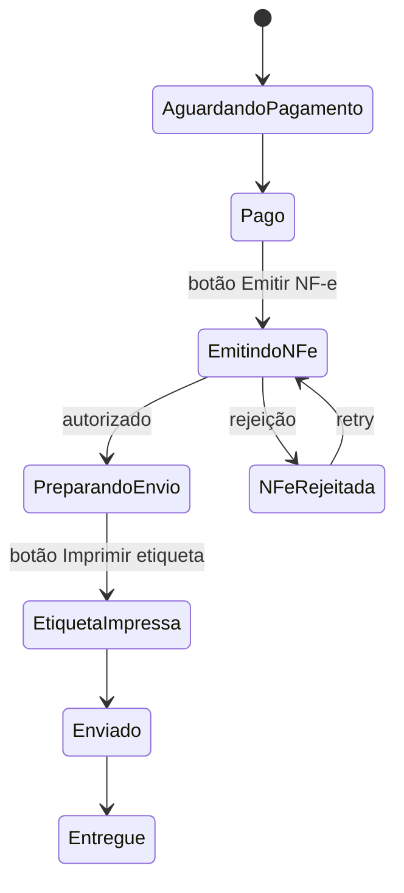

# Wireframes & mockups — Vilmo screens (plan)

Visual explanation of the UI understood so far. **Not implemented** — these are planning mockups. Runtime still copies Metronic 9.5.0 HTML (layout-1 + demo1). See [UI.md](./UI.md) and [USER_STORIES.md](./USER_STORIES.md).

Portuguese labels in the product. Images in [`wireframes/`](./wireframes/).

| File | Screen | Stories |
| --- | --- | --- |
| [wf_01_login.png](./wireframes/wf_01_login.png) | Login (one screen, three levels) | US-01 |
| [wf_02_admin_companies.png](./wireframes/wf_02_admin_companies.png) | Admin: companies + readiness | US-02, US-03 |
| [wf_03_create_company.png](./wireframes/wf_03_create_company.png) | Admin: nova empresa wizard | US-03 |
| [wf_04_company_home.png](./wireframes/wf_04_company_home.png) | Company: dashboard + all vendors’ sales | US-02, US-11 |
| [wf_05_create_vendor.png](./wireframes/wf_05_create_vendor.png) | Novo vendedor + marketplaces selecionados | US-10, US-11 |
| [wf_06_vendor_sales.png](./wireframes/wf_06_vendor_sales.png) | Vendor: minhas vendas | US-12 |
| [wf_07_sale_paid_nfe.png](./wireframes/wf_07_sale_paid_nfe.png) | Sale **Pago** → Emitir NF-e | US-06 |
| [wf_08_sale_label.png](./wireframes/wf_08_sale_label.png) | **Preparando para envio** → etiqueta 10×15 | US-07 |

---

## Sitemap (who lands where)



---

## Shell by role (sidebar is the product)

```
┌──────────────┬─────────────────────────────────────────────┐
│ VILMO        │  [Empresa ▾ CNPJ]     badge  nome  sair     │
│              ├─────────────────────────────────────────────┤
│  menu…       │  page title                    [primary btn]│
│  menu…       │  filters / KPIs                             │
│  menu…       │  table / form / wizard                      │
└──────────────┴─────────────────────────────────────────────┘
```

| Role | Badge | Sidebar (nothing else) |
| --- | --- | --- |
| **Admin** | Admin | Empresas, Usuários, Dashboard, NF-e / Estoque, Produtos, Anúncios, **Vendas**, Vendedores, Marketplaces, Configurações |
| **Company** | Empresa | Dashboard, NF-e / Estoque, Produtos, Anúncios, **Vendas**, Vendedores, Marketplaces, Configurações |
| **Vendor** | Vendedor | Dashboard, **Minhas vendas**, Meus anúncios, Meus marketplaces, Perfil |

Company switcher in the header: **Admin only** (any CNPJ). Company/Vendor: name of their CNPJ, not a picker of other legal entities.

---

## 1. Login


- One URL. No `/admin` login.
- Email + senha → JWT. Wrong credentials: same generic error.
- After success: Admin → Empresas; Company → Dashboard; Vendor → Minhas vendas.

---

## 2. Admin — Empresas


Readiness lights on each row (US-03):

| Light | Meaning |
| --- | --- |
| Listar | ≥1 marketplace **Linked** |
| Sync | webhooks + tokens |
| NF-e | A1 + IE + série |

**Nova empresa** opens the wizard.

---

## 3. Admin — Nova empresa (wizard)


| Step | Content | Unlocks |
| --- | --- | --- |
| 1 Identidade | Razão, CNPJ, IE, endereço, CEP 8 | Save Draft |
| 2 Fiscal | A1 Dropzone, série/nNF, regime, CFOP | `ready_to_invoice` |
| 3 Marketplaces | Checkboxes ML / Shopee / SHEIN / Magalu + app keys / OAuth | `ready_to_list` / `ready_to_sync_sales` |
| 4 Usuário empresa | Optional US-09 | Company login |

Traffic lights on the right stay gray until each block is complete. **Salvar rascunho** is allowed with only step 1.

---

## 4. Company — home (all vendors)


- Badge **Empresa**. No Empresas catalog, no creating other CNPJs.
- Sales table includes a **Vendedor** column (Ana, Carlos, …) — this is how “check all his sales” is visible.
- **Novo vendedor** → same form as admin vendor create, company id forced.

---

## 5. Novo vendedor (admin or company)


- Selected marketplaces only (empty list = error, or `*` for all enabled).
- Each checked code creates `user_detail_marketplace` with **PendingConnect**.
- **Conectar loja** runs official OAuth; then **Linked**.
- Company user: checkboxes limited to **this** CNPJ’s enabled channels.

**Novo usuário empresa** (admin only) is the same marketplace checkbox idea, but rows go to `user_company_marketplace` (company apps, not a personal shop).

```
┌─ Novo usuário empresa (Admin) ─────────────────────┐
│ E-mail  Nome  [convidar]                           │
│ Perfil: Empresa                                    │
│ ☐ Mercado Livre  ☐ Shopee  ☐ SHEIN  ☐ Magalu       │
│ (only codes already enabled on the company)        │
│                         [Cancelar] [Criar usuário] │
└────────────────────────────────────────────────────┘
```

---

## 6. Vendor — Minhas vendas


- No **Vendedor** column (it is always me).
- No Empresas / Vendedores / A1 menus.
- **Meus marketplaces**: list of shops + Connect if still pending.

---

## 7. Detalhe da venda — Pago → NF-e


| Status | Primary button | Hidden / disabled |
| --- | --- | --- |
| Aguardando pagamento | — | emit, label |
| **Pago** / NF-e rejeitada | **Emitir nota fiscal eletrônica** | label |
| Emitindo NF-e | spinner | |
| **Preparando para envio** / Etiqueta impressa | **Imprimir etiqueta para envio** | emit (already done) |
| Enviado / Entregue / Cancelado | — | |

Common block + accordion **Dados do marketplace** (`field_name` / `field_value`). Chips: canonical PT + raw remote status.

Confirm modal before emit: dest name, CPF/CNPJ, CEP, items, emitente **company CNPJ**.

---

## 8. Detalhe da venda — etiqueta Correios


- Size: **10 × 15 cm** default, or **13.8 × 10.6 cm**.
- Preview is a **sticker page**, not A4.
- Hint: maior lado da caixa; não cobrir código de barras; não dobrar arestas.
- Label content: destinatário (nome, endereço completo, CEP 8), remetente (loja, CNPJ, origem), serviço/rastreio, barcode real.

---

## Other screens (structure only — same shell)

### NF-e / Estoque — ingest

```
┌ NF-e / Estoque ─────────────────────────────────────┐
│ Tabs: Saldo | Entradas | Saídas | Ingerir           │
│ Ingerir: [chave 44        ] [Ingerir]               │
│          Dropzone XML                               │
│ Table movimentos: data, CFOP, sku, ± qtd, chave     │
└─────────────────────────────────────────────────────┘
```

### Produtos / Anúncios

```
┌ Produtos ─────────────── [Novo] [Publicar] ─────────┐
│ Table sku, nome, saldo, NCM                         │
│ Publicar modal: ☐ ML ☐ Shopee ☐ SHEIN ☐ Magalu      │
│ default = all Linked channels of this vendor        │
└─────────────────────────────────────────────────────┘
```

### Marketplaces (company apps)

```
┌ Marketplaces da empresa ────────────────────────────┐
│ ML      Linked     [Reconectar]  tokens masked      │
│ Shopee  Pending    [Conectar]                       │
│ Magalu  Linked                                      │
│ SHEIN   off                                         │
└─────────────────────────────────────────────────────┘
```

Admin catalog **Registrar marketplace** is a separate form (`POST /marketplaces`, new `code`, no deploy).

### Configurações — A1

Dropzone `.pfx` + senha. Shown for Admin/Company only. Turns the NF-e readiness light green.

---

## Status → UI (sale)



---

## What these mockups are not

- Not the production Metronic theme (colors/fonts will come from layout-1 + demo1).
- Not a promise that marketplace OAuth screens look like ours (those are the channel’s pages).
- Not every settings field — legal/fiscal lists stay in US-03.
