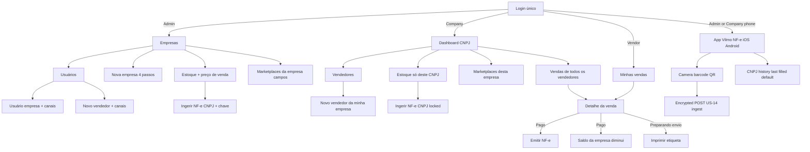
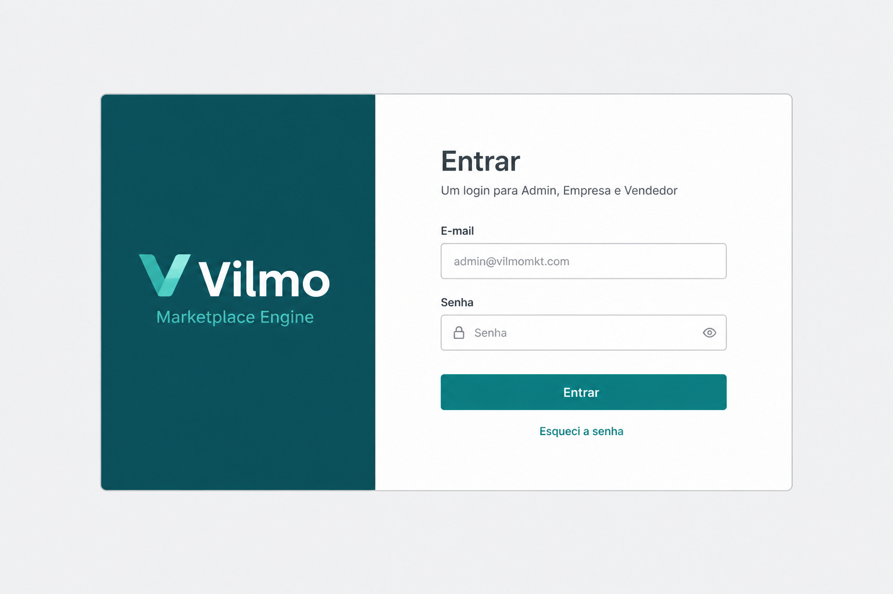
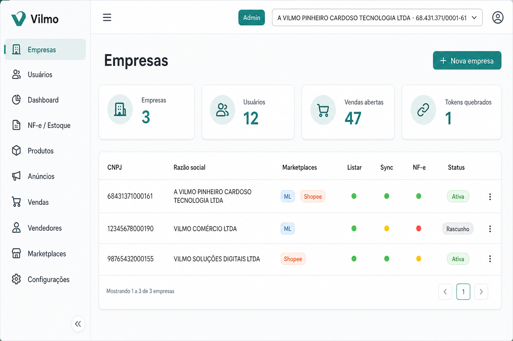
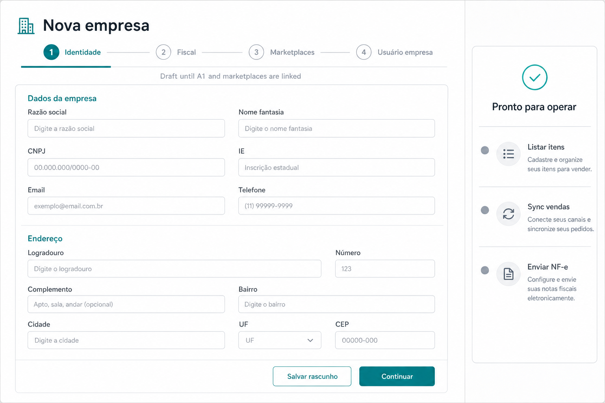
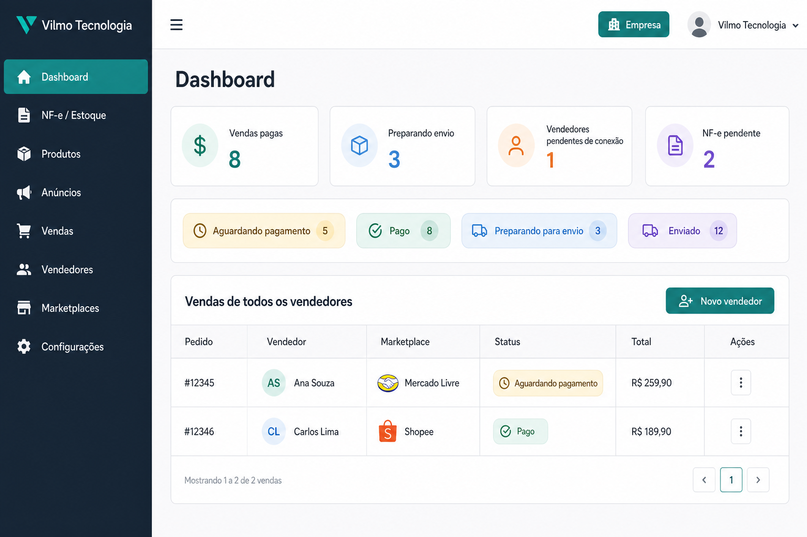
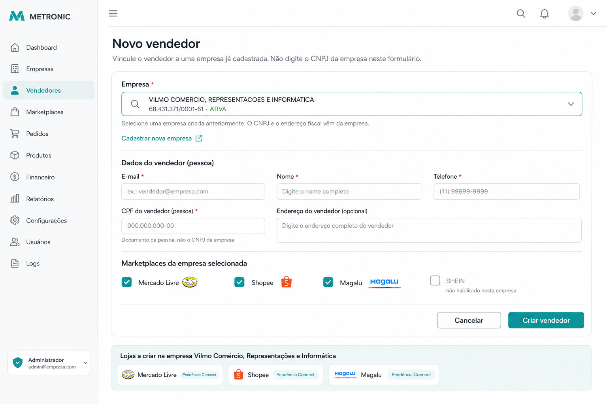
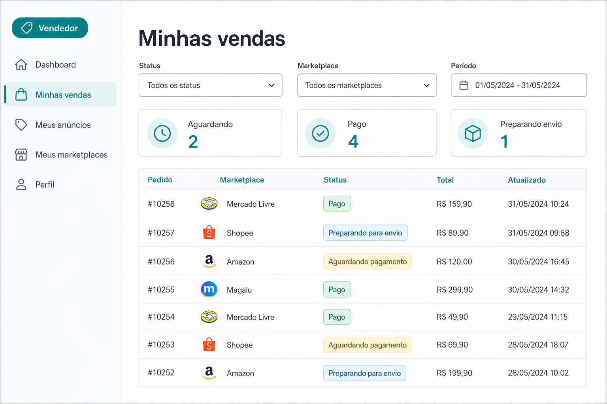
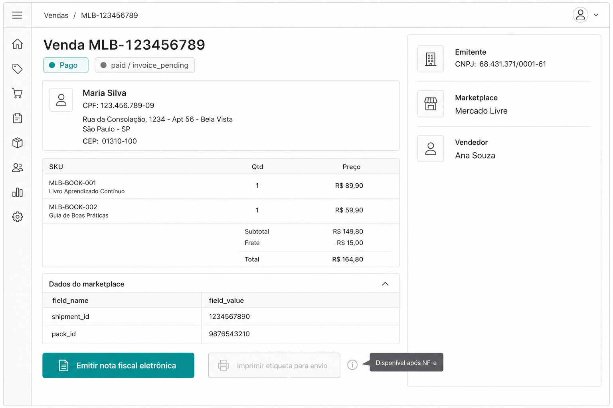
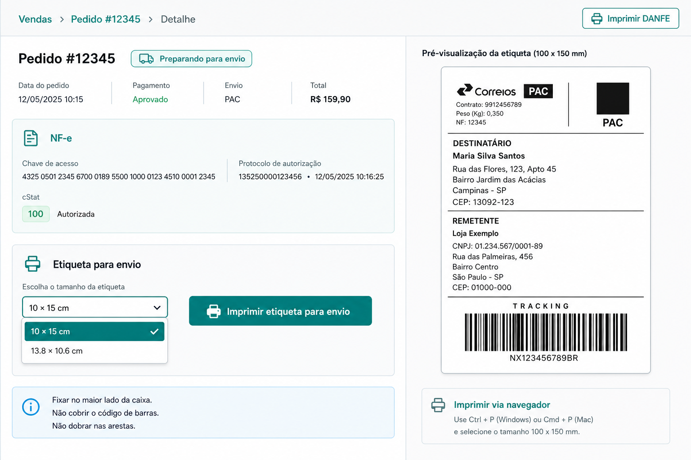
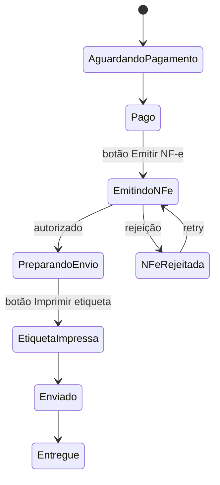

# Wireframes & mockups — Vilmo screens (plan)

Visual explanation of the UI understood so far. **Not implemented** — these are planning mockups. Runtime still copies Metronic 9.5.0 HTML (layout-1 + demo1). See [UI.md](./UI.md) and [USER_STORIES.md](./USER_STORIES.md).

Portuguese labels in the product. Images in [`wireframes/`](./wireframes/).

| File | Screen | Stories |
| --- | --- | --- |
| [wf_01_login.png](./wireframes/wf_01_login.png) | Login (one screen, three levels) | US-01 |
| [wf_02_admin_companies.png](./wireframes/wf_02_admin_companies.png) | Admin: companies + readiness | US-02, US-03 |
| [wf_03_create_company.png](./wireframes/wf_03_create_company.png) | Admin: nova empresa wizard | US-03 |
| [wf_04_company_home.png](./wireframes/wf_04_company_home.png) | Company: dashboard + all vendors’ sales | US-02, US-11 |
| [wf_05_create_vendor.png](./wireframes/wf_05_create_vendor.png) | Novo vendedor + marketplaces selecionados | US-10, US-11 |
| [wf_06_vendor_sales.png](./wireframes/wf_06_vendor_sales.png) | Vendor: minhas vendas | US-12 |
| [wf_07_sale_paid_nfe.png](./wireframes/wf_07_sale_paid_nfe.png) | Sale **Pago** → Emitir NF-e | US-06 |
| [wf_08_sale_label.png](./wireframes/wf_08_sale_label.png) | **Preparando para envio** → etiqueta 10×15 | US-07 |
| ASCII in this file | **Estoque** + preço de venda | US-13 |
| ASCII in this file | **Ingerir NF-e** (CNPJ + chave + **câmera**) | US-14 |
| ASCII in this file | **Vilmo NF-e** iOS/Android (scan + CNPJ cache) | US-16 |
| ASCII in this file | **Marketplaces da empresa** — connection fields | US-15 |

---

## Sitemap (who lands where)



Vendor has **no** Estoque / Ingerir NF-e / company marketplace-connection / **Vilmo NF-e app ingest** nodes. Paid decreases **company** stock, not a vendor warehouse.

---

## Shell by role (sidebar is the product)

```
┌──────────────┬─────────────────────────────────────────────┐
│ VILMO        │  [Empresa ▾ CNPJ]     badge  nome  sair     │
│              ├─────────────────────────────────────────────┤
│  menu…       │  page title                    [primary btn]│
│  menu…       │  filters / KPIs                             │
│  menu…       │  table / form / wizard                      │
└──────────────┴─────────────────────────────────────────────┘
```

| Role | Badge | Sidebar (nothing else) |
| --- | --- | --- |
| **Admin** | Admin | Empresas, Usuários, Dashboard, **Estoque**, **Ingerir NF-e**, Produtos, Anúncios, **Vendas**, Vendedores, **Marketplaces** (campos de conexão), Configurações |
| **Company** | Empresa | Dashboard, **Estoque**, **Ingerir NF-e**, Produtos, Anúncios, **Vendas**, Vendedores, **Marketplaces** (desta empresa), Configurações |
| **Vendor** | Vendedor | Dashboard, **Minhas vendas**, Meus anúncios, Meus marketplaces, Perfil |

Company switcher in the header: **Admin only** (any CNPJ). Company/Vendor: name of their CNPJ, not a picker of other legal entities.

---

## 1. Login



- One URL. No `/admin` login.
- Email + senha → JWT. Wrong credentials: same generic error.
- After success: Admin → Empresas; Company → Dashboard; Vendor → Minhas vendas.

---

## 2. Admin — Empresas



Readiness lights on each row (US-03):

| Light | Meaning |
| --- | --- |
| Listar | ≥1 marketplace **Linked** |
| Sync | webhooks + tokens |
| NF-e | A1 + IE + série |

**Nova empresa** opens the wizard.

---

## 3. Admin — Nova empresa (wizard)



| Step | Content | Unlocks |
| --- | --- | --- |
| 1 Identidade | Razão, CNPJ, IE, endereço, CEP 8 | Save Draft |
| 2 Fiscal | A1 Dropzone, série/nNF, regime, CFOP | `ready_to_invoice` |
| 3 Marketplaces | Checkboxes + **connection fields per code** (ClientId, PartnerKey, …) + OAuth | `ready_to_list` / `ready_to_sync_sales` |
| 4 Usuário empresa | Optional US-09 | Company login |

Traffic lights on the right stay gray until each block is complete. **Salvar rascunho** is allowed with only step 1.

---

## 4. Company — home (all vendors)



- Badge **Empresa**. No Empresas catalog, no creating other CNPJs.
- Sales table includes a **Vendedor** column (Ana, Carlos, …) — this is how “check all his sales” is visible.
- **Estoque** and **Ingerir NF-e** are in the sidebar (US-13, US-14). This CNPJ’s stock only. Vendors of this company do not see those menus.
- **Novo vendedor** → form with **Empresa locked** to this CNPJ (US-11). Admin uses a **company select** instead (US-10).

---

## 5. Novo vendedor — select an existing company



The old mockup looked like you typed a CNPJ to “be” the company. That is wrong.

| Role | Empresa control |
| --- | --- |
| **Admin** | Required **select** of companies already created (fantasia + CNPJ). Search by name or CNPJ. Cannot invent a CNPJ here. Empty list → link to Nova empresa. |
| **Company** | Same layout, Empresa **read-only** (their CNPJ). |

Then: vendor person (e-mail, nome, telefone, optional CPF **da pessoa**). Then marketplaces **of the selected company** only.

- Company CNPJ / razão / A1 / fiscal address are **not** fields on this form.
- Each checked code creates `user_detail_marketplace` with **PendingConnect**.
- **Conectar loja** → OAuth → **Linked**.

**Novo usuário empresa** (admin only) is the same marketplace checkbox idea, but rows go to `user_company_marketplace` (company apps, not a personal shop).

```
┌─ Novo usuário empresa (Admin) ─────────────────────┐
│ E-mail  Nome  [convidar]                           │
│ Perfil: Empresa                                    │
│ ☐ Mercado Livre  ☐ Shopee  ☐ SHEIN  ☐ Magalu       │
│ (only codes already enabled on the company)        │
│                         [Cancelar] [Criar usuário] │
└────────────────────────────────────────────────────┘
```

---

## 6. Vendor — Minhas vendas



- No **Vendedor** column (it is always me).
- No Empresas / Vendedores / A1 menus.
- **Meus marketplaces**: list of shops + Connect if still pending.

---

## 7. Detalhe da venda — Pago → NF-e



| Status | Primary button | Hidden / disabled |
| --- | --- | --- |
| Aguardando pagamento | — | emit, label |
| **Pago** / NF-e rejeitada | **Emitir nota fiscal eletrônica** | label |
| Emitindo NF-e | spinner | |
| **Preparando para envio** / Etiqueta impressa | **Imprimir etiqueta para envio** | emit (already done) |
| Enviado / Entregue / Cancelado | — | |

Common block + accordion **Dados do marketplace** (`field_name` / `field_value`). Chips: canonical PT + raw remote status.

Confirm modal before emit: dest name, CPF/CNPJ, CEP, items, emitente **company CNPJ**.

---

## 8. Detalhe da venda — etiqueta Correios



- Size: **10 × 15 cm** default, or **13.8 × 10.6 cm**.
- Preview is a **sticker page**, not A4.
- Hint: maior lado da caixa; não cobrir código de barras; não dobrar arestas.
- Label content: destinatário (nome, endereço completo, CEP 8), remetente (loja, CNPJ, origem), serviço/rastreio, barcode real.

---

## Other screens (structure only — same shell)

### NF-e / Estoque — saldo e preço (US-13)

Admin and Company only. Vendor: no menu.

```
┌ Estoque  (Empresa: VILMO … 68.431.371/0001-61) ─────┐
│ SKU │ Descrição      │ Saldo │ Preço de venda │     │
│ CAM1│ Camiseta preta │   12  │ [ R$ 89,90  ]  │     │
│ CAL2│ Calça jeans    │    3  │ [ R$ 159,00 ]  │     │
│                    [Salvar preços]  [Ingerir NF-e]  │
└─────────────────────────────────────────────────────┘
```

- **Saldo** = actual on-hand (`inventory_balance.on_hand`).
- **Preço de venda** editable. Saved with `PUT /products/{sku}/sale-price`.
- Company user: this CNPJ only. Admin: header company switcher.
- When a sale becomes **Pago**, saldo **decreases by the sold qty** (not again at emit NF-e).

### Ingerir NF-e — CNPJ + chave (US-14)

```
┌ Ingerir NF-e ───────────────────────────────────────┐
│ CNPJ da empresa  [ select / locked ]                │
│ Chave de acesso  [ 44 dígitos                    ]  │
│ [Ler código (câmera)]  barcode / QR da DANFE        │
│ [Ingerir na Receita / SEFAZ]                        │
│ XML (opcional)   [ Dropzone ]                       │
│ Resultado: +12 CAM1, +3 CAL2  | chave ABC…          │
└─────────────────────────────────────────────────────┘

┌ Câmera ─────────────────────────────────────────────┐
│  [ live preview + viewfinder ]                      │
│  Aponte para o código de barras ou QR da DANFE      │
│  [Trocar câmera]                        [Cancelar]  │
└─────────────────────────────────────────────────────┘
```

- Admin: pick existing company (shows CNPJ). Company: CNPJ locked.
- **Ler código** opens the **webcam** (`getUserMedia`). Decode Code 128 / QR in the browser → 44-digit chave. User still taps Ingerir.
- Permission denied: type the chave. Video is not uploaded.
- DistDFe with **that** company's A1. Inbound items **increase** saldo.
- Same chave twice does not add qty again.

### App Vilmo NF-e — iOS / Android (US-16)

Separate from Metronic. Same login (Admin / Empresa). Vendor: blocked.

```
┌ Vilmo NF-e ─────────────────────────────────────────┐
│ CNPJ  [ 68.431.371/0001-61 ▾ ]  ← last filled       │
│       histórico: 68.431…  |  12.345…  | + novo      │
│ Chave [ 44 dígitos                               ]  │
│ [Ler código]  câmera barcode / QR                   │
│ [Enviar criptografado]                              │
│ OK +12 CAM1                                         │
└─────────────────────────────────────────────────────┘
```

- CNPJ history encrypted on the device. Default **always last filled**.
- Enviar → `POST /nfe/mobile/ingest` (AES-GCM + TLS pin), then DistDFe as US-14.
- Chave/CNPJ not stored as photos; tokens in Keychain/Keystore.

### Produtos / Anúncios

```
┌ Produtos ─────────────── [Novo] [Publicar] ─────────┐
│ Table sku, nome, saldo, NCM                         │
│ Publicar modal: ☐ ML ☐ Shopee ☐ SHEIN ☐ Magalu      │
│ default = all Linked channels of this vendor        │
└─────────────────────────────────────────────────────┘
```

### Marketplaces da empresa — connection fields (US-15)

Admin and Company only. Vendor: **Meus marketplaces** (own shop), not this screen.

```
┌ Marketplaces da empresa  (VILMO … 68.431.371/0001-61) ──┐
│ ▾ Mercado Livre     [Habilitado]  Linked                │
│   ClientId (APP ID)  [ 1234567890123456            ]    │
│   ClientSecret       [ ••••••••••              ] keep   │
│   SiteId             [ MLB                         ]    │
│   Redirect  https://vilmomkt.com/oauth/MercadoLivre/…   │
│   Webhook   https://vilmomkt.com/webhooks/MercadoLivre  │
│   Avançado: AccessToken / RefreshToken / UserId masked  │
│                    [Salvar]  [Reconectar]               │
│ ▾ Shopee            [Habilitado]  PendingConnect        │
│   PartnerId          [                                 ] │
│   PartnerKey         [                                 ] │
│                    [Salvar]  [Conectar]                 │
│ ▸ Magalu            [ ] off                             │
│ ▸ SHEIN             [ ] off                             │
└─────────────────────────────────────────────────────────┘
```

- Fields come from `marketplace_parameter_definition` (`scope = company`), not a C# switch.
- Secrets: GET never returns the full value; omit on save = keep.
- Same fields appear in Nova empresa wizard step 3.
- Admin catalog **Registrar marketplace** is a separate form (`POST /marketplaces`, new `code`, no deploy). That new code then appears here with its own fields.

### Configurações — A1

Dropzone `.pfx` + senha. Shown for Admin/Company only. Turns the NF-e readiness light green.

---

## Status → UI (sale)



---

## What these mockups are not

- Not the production Metronic theme (colors/fonts will come from layout-1 + demo1).
- Not a promise that marketplace OAuth screens look like ours (those are the channel’s pages).
- Not every settings field — legal/fiscal lists stay in US-03.
